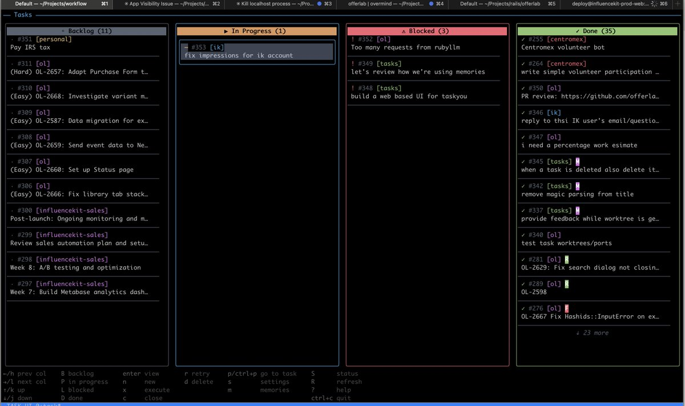
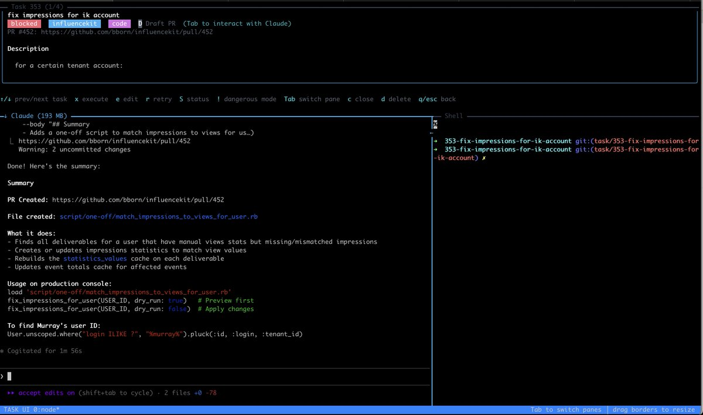
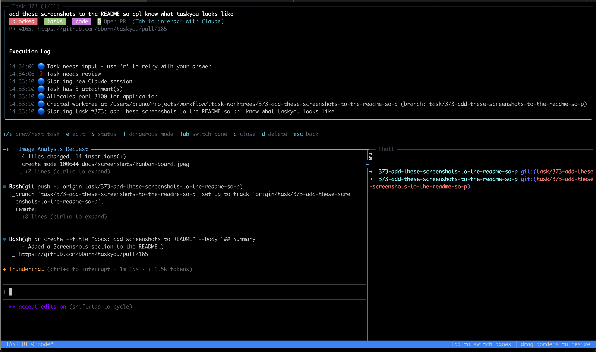
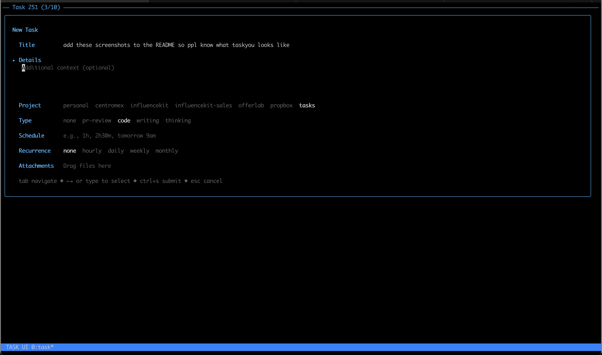

# Task You

A personal task management system with a beautiful terminal UI, SQLite storage, and background task execution via pluggable AI agents (Claude Code, OpenAI Codex, Gemini, Pi, OpenClaw, or OpenCode).

## Screenshots

### Kanban Board

*The main view showing tasks organized across Backlog, In Progress, Blocked, and Done columns*

### Task Detail View

*Viewing a task with Claude's output and shell access in split panes*

### Execution Log

*Live execution log showing task progress, worktree creation, and Claude's actions*

### New Task Form

*Creating a new task with project selection, type, scheduling, and attachments*

## Features

- **Kanban Board** - Visual task management with 4 columns (Backlog, In Progress, Blocked, Done)
- **Git Worktrees** - Each task runs in an isolated worktree, no conflicts between parallel tasks
- **Pluggable Executors** - Choose between Claude Code, OpenAI Codex, Gemini, Pi, OpenClaw, or OpenCode per task
- **Ghost Text Autocomplete** - LLM-powered suggestions for task titles and descriptions as you type
- **VS Code-style Fuzzy Search** - Quick task navigation with smart matching (e.g., "dsno" matches "diseno website")
- **Markdown Rendering** - Task descriptions render with proper formatting in the detail view
- **Real-time Updates** - Watch tasks execute live
- **Running Process Indicator** - Green dot (`●`) shows which tasks have active shell processes (servers, watchers, etc.)
- **Auto-cleanup** - Automatic cleanup of Claude processes for completed tasks (see maintenance commands for config cleanup)
- **Fully Scriptable CLI** - 100% of Task You is controllable via CLI—agents can manage tasks, read executor output, and send input to running executors programmatically (see [Full CLI Scriptability](#full-cli-scriptability))
- **SSH Access** - Run as an SSH server to access your tasks from anywhere (see [SSH Access & Deployment](#ssh-access--deployment))

## Prerequisites

- **Go 1.24.4+** - Required to build the project

### Using mise (recommended)

If you use [mise](https://mise.jdx.dev/) for dependency management, simply run:

```bash
mise install
```

This will install the correct Go version automatically.

### Manual installation

Install Go 1.24.4 or later from [go.dev/dl](https://go.dev/dl/).

## Installation

### Quick Install (recommended)

```bash
curl -fsSL taskyou.dev/install.sh | bash
```

This downloads the latest release and installs `ty` (with `taskyou` as an alias) to `~/.local/bin`.

You can also specify a custom install directory:

```bash
INSTALL_DIR=~/.local/bin curl -fsSL taskyou.dev/install.sh | bash
```

### Build from source

```bash
git clone https://github.com/bborn/taskyou
cd taskyou
make build
```

## Usage

```bash
# Launch the TUI (auto-starts background daemon)
./bin/ty
```

### Daemon management

```bash
./bin/ty daemon         # Start daemon manually
./bin/ty daemon stop    # Stop the daemon
./bin/ty daemon status  # Check daemon status
```

### Maintenance commands

```bash
./bin/ty purge-claude-config            # Remove stale ~/.claude.json entries
./bin/ty purge-claude-config --dry-run  # Preview what would be removed
./bin/ty claudes cleanup                # Kill orphaned Claude processes
```

### Full CLI Scriptability

**Task You is 100% scriptable.** Every action you can perform in the TUI is available via the `ty` CLI, making it trivial for AI agents, scripts, or external orchestrators to control your entire task queue programmatically.

This includes:
- **Board state** - `ty board --json` returns the full Kanban snapshot
- **Task management** - `ty create`, `ty execute`, `ty retry`, `ty status`, `ty pin`, `ty close`, `ty archive`, `ty delete`
- **Direct executor interaction** - `ty input` sends keystrokes/text to running executors, `ty output` reads their output
- **Session management** - `ty sessions list`, `ty sessions cleanup`

Because agents can send input to running executors via `ty input`, they can answer prompts, confirm dialogs, navigate menus, and fully control tasks mid-execution—no human intervention required.

See [docs/orchestrator.md](docs/orchestrator.md) for a complete guide to building your own orchestration agent.

**Auto-cleanup:** The daemon automatically cleans up Claude processes for tasks that have been done for more than 30 minutes, preventing memory bloat from orphaned processes.

> **Note:** Automatic cleanup currently only works for the Claude executor. When using other executors (Codex, Gemini, Pi, etc.), you may need to manually clean up processes using `ty sessions cleanup` to prevent memory bloat.

### AI Agent Skill

Task You includes a `/taskyou` skill that teaches any AI agent how to orchestrate your task queue via CLI.

**Automatic availability:** The skill is automatically available when working inside the Task You project directory (via `skills/taskyou/`).

**Global installation:** To use the skill from any project:

```bash
./scripts/install-skill.sh
```

Once available, you can ask Claude things like:
- "Show me my task board"
- "Execute the top priority task"
- "What's blocked right now?"
- "Create a task to fix the login bug"

The skill works with Claude Code, Codex, Gemini, or any agent that can execute shell commands. It provides structured guidance for common orchestration patterns without needing to memorize CLI flags.

## Keyboard Shortcuts

### Kanban Board

| Key | Action |
|-----|--------|
| `←/→` or `h/l` | Navigate columns |
| `↑/↓` or `j/k` | Navigate tasks |
| `Enter` | View task details |
| `n` | Create new task |
| `x` | Execute (queue) task |
| `r` | Retry task with feedback |
| `c` | Close task |
| `a` | Archive task |
| `d` | Delete task |
| `t` | Pin/unpin task |
| `o` | Open task's working directory |
| `p` | Command palette (fuzzy search) |
| `/` | Filter tasks |
| `s` | Settings |
| `?` | Toggle help |
| `q` | Quit |

### Task Detail View

| Key | Action |
|-----|--------|
| `e` | Edit task |
| `x` | Execute task |
| `r` | Retry with feedback |
| `S` | Change task status |
| `t` | Pin/unpin task |
| `!` | Toggle dangerous/safe mode |
| `\` | Toggle shell pane visibility |
| `Shift+↑/↓` | Switch between panes |
| `Alt+Shift+↑/↓` | Jump to prev/next task (stays in executor pane) |
| `c` | Close task |
| `a` | Archive task |
| `d` | Delete task |
| `Esc` | Back to kanban |

### Task Form (Autocomplete)

| Key | Action |
|-----|--------|
| `Tab` | Accept ghost text suggestion |
| `Escape` | Dismiss suggestion |
| `Ctrl+Space` | Manually trigger suggestion |

## Task Lifecycle

```
backlog → queued → processing → done
                 ↘ blocked (needs input)
```

| Status | Description |
|--------|-------------|
| `backlog` | Created but not started |
| `queued` | Waiting to be processed |
| `processing` | Currently being executed |
| `blocked` | Needs input/clarification |
| `done` | Completed |

## Task Executors

Task You supports multiple AI executors for processing tasks. You can choose the executor when creating or editing a task.

> Developers who want to add another backend should read [`docs/executor_interface.md`](docs/executor_interface.md) for the full `TaskExecutor` contract.

| Executor | CLI | Description |
|----------|-----|-------------|
| Claude (default) | `claude` | [Claude Code](https://claude.ai/claude-code) - Anthropic's coding agent with session resumption |
| Codex | `codex` | [OpenAI Codex CLI](https://github.com/openai/codex) - OpenAI's coding assistant |
| Gemini | `gemini` | [Gemini CLI](https://ai.google.dev/gemini-api/docs/cli) - Google's Gemini-based coding assistant |
| Pi | `pi` | [Pi Coding Agent](https://github.com/mariozechner/pi-coding-agent) - Multi-provider AI coding agent with session continuity |
| OpenCode | `opencode` | [OpenCode](https://opencode.ai) - Open-source AI coding assistant with multi-LLM support |
| OpenClaw | `openclaw` | [OpenClaw](https://openclaw.ai) - Open-source personal AI assistant with session resumption |

All executors run in tmux windows with the same worktree isolation and environment variables. The main differences:

- **Claude Code**, **Pi**, and **OpenClaw** support session resumption - when you retry a task, they continue with full conversation history
- **Codex** and **Gemini** start fresh on each execution but receive the full prompt with any feedback
- **OpenCode** does not support session resumption

### Installing Executors

At least one executor CLI must be installed for tasks to run:

```bash
# Claude Code (recommended)
# See https://claude.ai/claude-code for installation

# OpenAI Codex CLI
npm install -g @openai/codex

# Google Gemini CLI
# See https://ai.google.dev/gemini-api/docs/cli for installation instructions

# Pi Coding Agent
npm install -g @mariozechner/pi-coding-agent

# OpenClaw
npm install -g openclaw@latest
openclaw onboard  # Run setup wizard
```

### How Task Executors Work

Understanding how Task You manages executor processes helps you debug issues and work with running tasks.

#### tmux-Based Architecture

Task executors run inside **tmux windows** within a daemon session:

```
task-daemon-{PID}              (tmux session)
├── _placeholder               (keeps session alive)
├── task-123                   (window for task 123)
│   ├── pane 0: Executor       (left - Claude/Codex output)
│   └── pane 1: Shell          (right - workdir access)
├── task-124                   (window for task 124)
└── ...
```

When you execute a task:
1. The daemon ensures a `task-daemon-*` session exists
2. Creates a new tmux window named `task-{ID}`
3. Spawns the configured executor (Claude or Codex) with environment variables and the task prompt
4. Creates a shell pane for manual intervention

#### Session Tracking

Each task tracks its executor state in the database:

| Field | Purpose |
|-------|---------|
| `SessionID` | Executor session ID (Claude only, for resumption) |
| `TmuxWindowID` | Unique window target for tmux commands |
| `daemon_session` | Which `task-daemon-*` owns this task |
| `Port` | Unique port (3100-4099) for the worktree |

#### Managing Executor Processes

**Inside the TUI:**
- The green dot (`●`) indicates tasks with active processes

**From the command line:**

```bash
# List all running executor processes
./bin/ty sessions list

# Kill orphaned executor processes
./bin/ty sessions cleanup
```

**Direct executor interaction:**

```bash
# See what the executor is outputting
./bin/ty output <id>              # Last 50 lines
./bin/ty output <id> --lines 100  # More history

# Send input directly to a running executor
./bin/ty input <id> "yes"         # Send text + Enter
./bin/ty input <id> --enter       # Just press Enter (confirm prompts)
./bin/ty input <id> --key Down --enter  # Navigate + confirm
echo "continue" | ./bin/ty input <id>   # Pipe input
```

**Inside a task worktree:**

When working in a task's worktree directory, you can interact with the executor directly. For Claude tasks:

```bash
cd /path/to/project/.task-worktrees/123-my-task/

# List Claude sessions (shows any spawned for this directory)
claude -r

# Resume a specific session
claude --resume {session-id}
```

The `claude -r` command shows Claude sessions associated with the current directory. This is useful when:
- Debugging why a task got stuck
- Continuing work manually after a task completes
- Checking what the executor was doing in a specific task

#### Session Resumption (Claude Only)

Claude Code supports **session resumption** - when you retry a task or press `R`, the executor reconnects to the existing conversation:

1. **First execution:** Claude starts fresh, prints a session ID
2. **Task You captures:** The session ID is stored in the database
3. **On retry/resume:** Runs `claude --resume {sessionID}` with your feedback
4. **Full context preserved:** Claude sees the entire conversation history

This means when you retry a blocked task with feedback, Claude doesn't start over—it continues the conversation with full awareness of what it already tried.

**Note:** Codex and Gemini do not support session resumption. When retrying these tasks, they receive the full prompt including any feedback, but start a fresh session. Claude Code and OpenClaw support full session resumption.

#### Lifecycle & Cleanup

| Event | Behavior |
|-------|----------|
| Task completes | Process stays alive for 30 minutes, then auto-killed |
| Task blocked | Process suspends after 6 hours of idle time |
| Task deleted | Window killed, worktree removed, teardown script runs |
| Daemon restart | Orphaned windows are cleaned up on next poll |

## Configuration

### Settings

Manage settings with `ty settings`:

```bash
ty settings                              # View all settings
ty settings set <key> <value>            # Set a value
```

| Setting | Description |
|---------|-------------|
| `anthropic_api_key` | API key for ghost text autocomplete (optional, uses API credits) |
| `autocomplete_enabled` | Enable/disable autocomplete (`true`/`false`) |

### Ghost Text Autocomplete

LLM-powered suggestions appear as you type task titles and descriptions, similar to GitHub Copilot:

- **Title suggestions** - Autocomplete as you type the task title
- **Body suggestions** - Auto-suggest a description when you tab from the title to an empty body field
- **Cursor-aware** - Ghost text renders at cursor position for natural editing
- **Smart caching** - Recent completions are cached for instant responses

**Setup:**
```bash
ty settings set anthropic_api_key sk-ant-your-key-here
```

**Controls:**
- `Tab` - Accept suggestion
- `Escape` - Dismiss suggestion
- `Ctrl+Space` - Manually trigger suggestion

Get an API key at [console.anthropic.com](https://console.anthropic.com/). This is optional and uses your API credits.

### Environment Variables

| Variable | Description | Default |
|----------|-------------|---------|
| `WORKTREE_DB_PATH` | SQLite database path | `~/.local/share/task/tasks.db` |
| `ANTHROPIC_API_KEY` | Fallback for autocomplete if not set in settings | - |

### `.taskyou.yml` Configuration

You can configure per-project settings by creating a `.taskyou.yml` file in your project root:

```yaml
worktree:
  init_script: bin/worktree-setup
```

**Supported filenames** (in order of precedence):
- `.taskyou.yml`
- `.taskyou.yaml`
- `taskyou.yml`
- `taskyou.yaml`

**Configuration options:**

| Field | Description | Example |
|-------|-------------|---------|
| `worktree.init_script` | Path to script that runs after worktree creation (relative or absolute) | `bin/worktree-setup` |
| `worktree.teardown_script` | Path to script that runs before worktree deletion (relative or absolute) | `bin/worktree-teardown` |

### Projects

Configure projects in Settings (`s`):

- **Name** - Project identifier (e.g., `myproject`)
- **Path** - Local filesystem path to git repo
- **Aliases** - Short names for quick reference
- **Instructions** - Project-specific AI instructions
- **Claude Config Dir** - Optional override for `CLAUDE_CONFIG_DIR` (use different Claude accounts per project)

### Worktrees

Tasks run in isolated git worktrees at `~/.local/share/task/worktrees/{project}/task-{id}`. This allows multiple tasks to run in parallel without conflicts. Press `o` to open a task's worktree.

#### Worktree Setup Script

You can configure a script to run automatically after each worktree is created. The setup script runs:
- **After** the git worktree is created
- **Before** the AI executor (Claude/Codex) starts working on the task
- When reusing an existing worktree that has already been checked out

This is useful for:
- Installing dependencies
- Setting up databases
- Copying configuration files
- Running migrations

**Two ways to configure:**

1. **Conventional location** - Create an executable script at `bin/worktree-setup`:
```bash
#!/bin/bash
# Example: bin/worktree-setup
bundle install
cp config/database.yml.example config/database.yml
```

2. **Custom location** - Specify in `.taskyou.yml`:
```yaml
worktree:
  init_script: scripts/my-setup.sh
```

The script runs in the worktree directory and has access to all worktree environment variables (`WORKTREE_TASK_ID`, `WORKTREE_PORT`, `WORKTREE_PATH`).

#### Worktree Teardown Script

You can configure a script to run automatically before a worktree is deleted.

**Important:** The teardown script **only runs when a task is deleted** (via the `d` key in the TUI or `task delete` command). It does **not** run when:
- A task completes (moves to `done` status)
- A task is archived or closed
- You manually remove the worktree via `git worktree remove` or `rm -rf`

This is useful for:
- Dropping task-specific databases
- Stopping background services
- Cleaning up docker containers
- Removing temporary files

**Two ways to configure:**

1. **Conventional location** - Create an executable script at `bin/worktree-teardown`:
```bash
#!/bin/bash
# Example: bin/worktree-teardown
bin/rails db:drop
```

2. **Custom location** - Specify in `.taskyou.yml`:
```yaml
worktree:
  teardown_script: scripts/my-teardown.sh
```

**Note:** If you want automated cleanup when tasks complete (not just when deleted), use [Task Lifecycle Hooks](#task-lifecycle-hooks) to trigger your teardown script on the `task.done` event.

### Running Applications in Worktrees

Each task provides environment variables that applications can use to run in isolation:

| Variable | Description | Example |
|----------|-------------|---------|
| `WORKTREE_TASK_ID` | Unique task identifier | `207` |
| `WORKTREE_PORT` | Unique port (3100-4099) | `3100` |
| `WORKTREE_PATH` | Path to the worktree | `/path/to/project/.task-worktrees/207-my-task` |

#### Loading Environment Variables

Each worktree includes a `.envrc` file with these variables. To load them:

- **With [direnv](https://direnv.net/)** (recommended): Variables load automatically when you `cd` into the worktree. Run `direnv allow` the first time.
- **Without direnv**: Run `source .envrc` manually.

These variables allow multiple tasks to run simultaneously without conflicts on ports or databases.

#### Example: Rails Application

Configure your Rails app to use worktree variables for complete isolation:

**config/puma.rb:**
```ruby
port ENV.fetch("WORKTREE_PORT", 3000)
```

**config/database.yml:**
```yaml
development:
  database: myapp_dev<%= ENV['WORKTREE_TASK_ID'] ? "_task#{ENV['WORKTREE_TASK_ID']}" : "" %>
```

**Procfile.dev:**
```
web: bin/rails server -p ${WORKTREE_PORT:-3000}
```

**bin/worktree-setup:**
```bash
#!/bin/bash
set -e

# Install dependencies
bundle install

# Create isolated database for this task
bin/rails db:create db:migrate
```

**bin/worktree-teardown:**
```bash
#!/bin/bash
# Drop the task-specific database
bin/rails db:drop
```

Now the AI executor (Claude or Codex) can:
- Run your app with `bin/dev`
- Access it at `http://localhost:$WORKTREE_PORT`
- Work on multiple tasks in parallel without database or port conflicts

#### Example: Node.js Application

**package.json:**
```json
{
  "scripts": {
    "dev": "next dev -p ${WORKTREE_PORT:-3000}"
  }
}
```

**bin/worktree-setup:**
```bash
#!/bin/bash
npm install
cp .env.example .env.local
```

### Task Lifecycle Hooks

Task lifecycle hooks let you run custom scripts when task status changes. This is useful for automation like sending notifications, triggering CI/CD, or running cleanup when tasks complete.

**Hook location:** `~/.config/task/hooks/`

Create an executable script named after the event you want to handle:

| Event | Filename | Triggered When |
|-------|----------|----------------|
| `task.started` | `~/.config/task/hooks/task.started` | Task moves to `queued` or `processing` |
| `task.done` | `~/.config/task/hooks/task.done` | Task completes successfully |
| `task.blocked` | `~/.config/task/hooks/task.blocked` | Task needs user input |
| `task.failed` | `~/.config/task/hooks/task.failed` | Task fails with an error |

**Environment variables available to hooks:**

| Variable | Description |
|----------|-------------|
| `TASK_ID` | Task ID |
| `TASK_TITLE` | Task title |
| `TASK_STATUS` | New task status |
| `TASK_PROJECT` | Project name |
| `TASK_TYPE` | Task type |
| `TASK_MESSAGE` | Status change message |
| `TASK_EVENT` | Event name (e.g., `task.done`) |

**Example: Run teardown on task completion**

Since the worktree teardown script only runs on task deletion, you can use the `task.done` hook to run cleanup when tasks complete:

```bash
#!/bin/bash
# ~/.config/task/hooks/task.done

# Get the worktree path for this task
WORKTREE_PATH="$HOME/.local/share/task/worktrees/${TASK_PROJECT}/task-${TASK_ID}"

# Run your project's teardown script if it exists
if [ -x "$WORKTREE_PATH/bin/worktree-teardown" ]; then
    cd "$WORKTREE_PATH"
    ./bin/worktree-teardown
fi
```

**Example: Send Slack notification**

```bash
#!/bin/bash
# ~/.config/task/hooks/task.done

curl -X POST -H 'Content-type: application/json' \
  --data "{\"text\":\"Task completed: ${TASK_TITLE}\"}" \
  "$SLACK_WEBHOOK_URL"
```

**Notes:**
- Hooks run in the background (non-blocking) with a 30-second timeout
- Hook failures are logged but don't affect task execution
- The hooks directory is created automatically at `~/.config/task/hooks/`

## SSH Access & Deployment

Task You can run as an SSH server, allowing you to access your task board from anywhere.

### Running the SSH Server

The `taskd` daemon provides SSH access to the TUI:

```bash
# Start SSH server on default port (2222)
./bin/taskd

# Custom port
./bin/taskd -addr :22222

# Custom database location
./bin/taskd -db /path/to/tasks.db

# Custom SSH host key
./bin/taskd -host-key ~/.ssh/custom_key
```

Once running, connect from any machine:

```bash
ssh -p 2222 username@your-server.com
```

Replace `your-server.com` with your server's hostname or IP address. The SSH server accepts public key authentication (currently accepts all keys - see [Security](#security) below).

### Deployment

#### Building for Linux

If deploying from macOS to a Linux server:

```bash
make build-linux
```

This creates Linux binaries in `./bin/`.

#### Installing as a Systemd Service

For persistent SSH access, install taskd as a systemd service:

```bash
./scripts/install-service.sh
```

This creates `~/.config/systemd/user/taskd.service` and enables it to start on boot.

Manage the service with:

```bash
systemctl --user status taskd   # Check status
systemctl --user start taskd    # Start
systemctl --user stop taskd     # Stop
systemctl --user restart taskd  # Restart
journalctl --user -u taskd      # View logs
```

#### Security

**Important:** The SSH server currently accepts all public keys. For production use, edit `internal/server/ssh.go`:

```go
wish.WithPublicKeyAuth(func(ctx ssh.Context, key ssh.PublicKey) bool {
    // Compare key fingerprint against allowed list
    allowed := map[string]bool{
        "SHA256:your-allowed-key-fingerprint": true,
    }
    return allowed[ssh.FingerprintSHA256(key)]
})
```

Get your key fingerprint with:

```bash
ssh-keygen -lf ~/.ssh/id_ed25519.pub
```

Password authentication is disabled by default.

## Development

```bash
make build        # Build binaries
make test         # Run tests
make install      # Install to ~/go/bin
```

## Tech Stack

- [Bubble Tea](https://github.com/charmbracelet/bubbletea) - TUI framework
- [Lip Gloss](https://github.com/charmbracelet/lipgloss) - Terminal styling
- [Wish](https://github.com/charmbracelet/wish) - SSH server
- [SQLite](https://modernc.org/sqlite) - Local database
