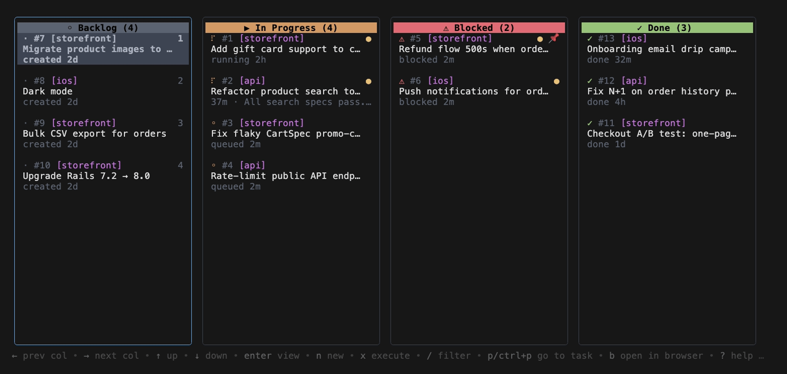
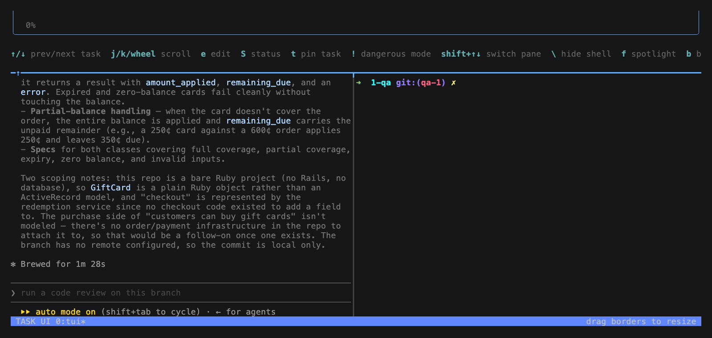
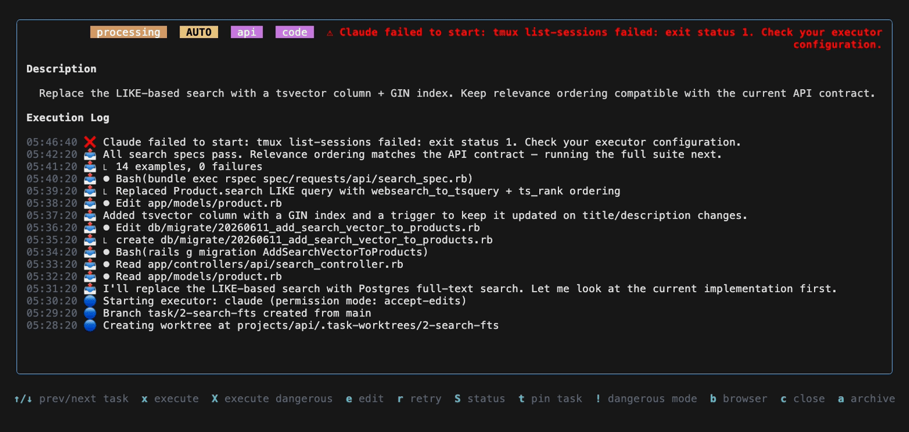
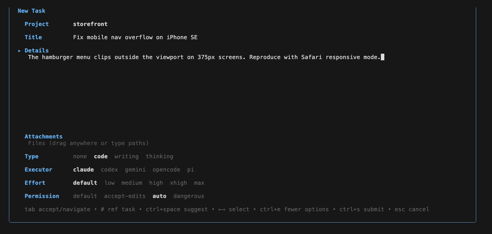
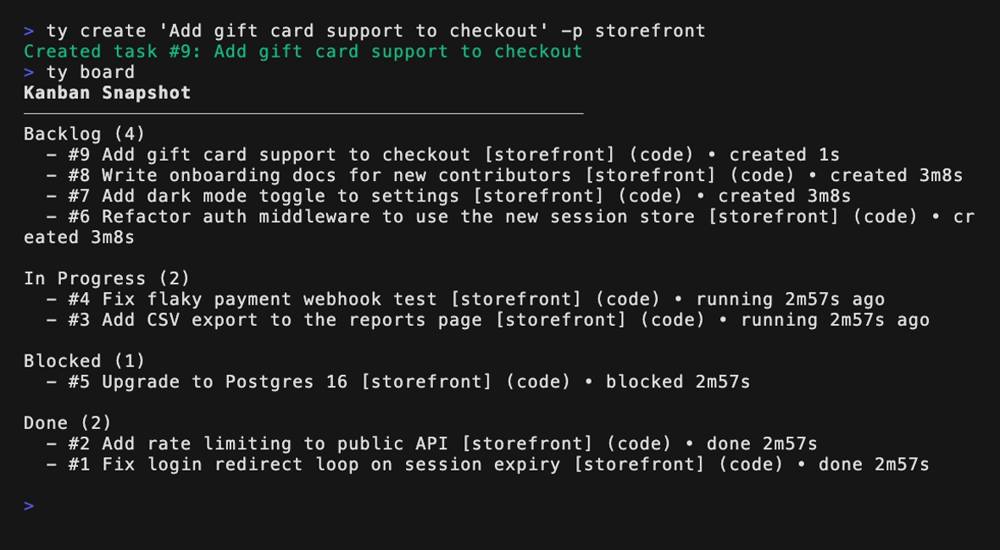
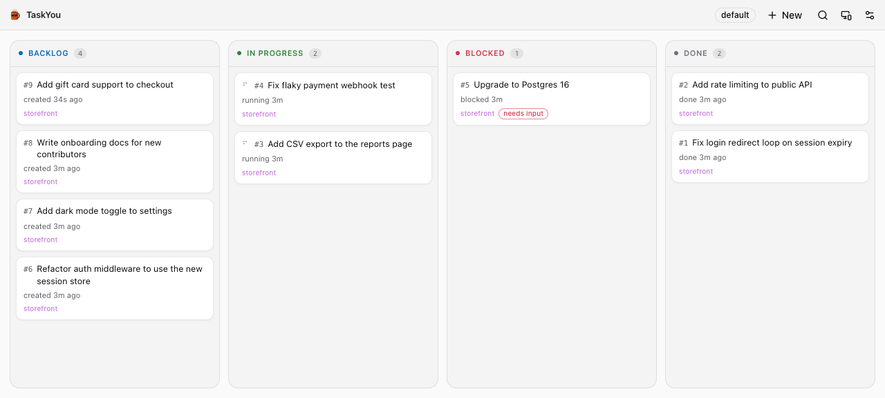
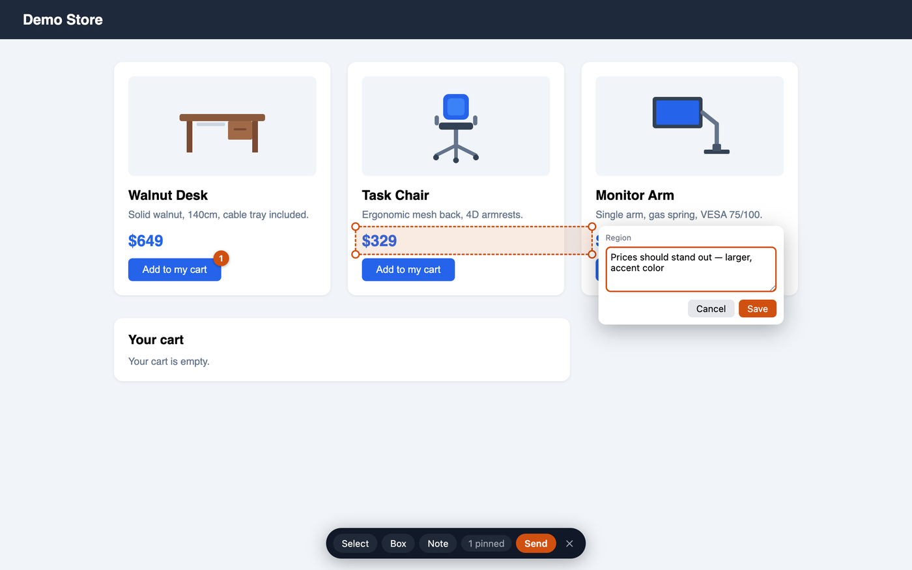
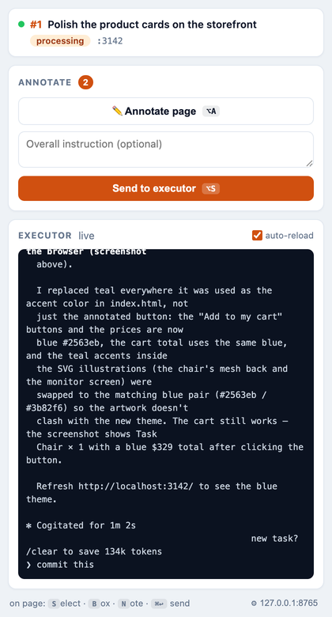

[](https://github.com/bborn/taskyou/actions/workflows/ci.yml)
[](https://pkg.go.dev/github.com/bborn/workflow)
[](https://goreportcard.com/report/github.com/bborn/workflow)

# Task You

A personal task management system with background task execution via pluggable AI agents (Claude Code, OpenAI Codex, Gemini, Pi, OpenClaw, or OpenCode). Tasks live in SQLite, run in isolated git worktrees, and are tracked on a Kanban board.

One engine — `ty` — three interfaces:

| Interface | What it is |
|-----------|------------|
| **[TUI](#the-tui--first-class)** | The first-class interface. The full experience in your terminal: Kanban board, task detail with live executor panes, forms, fuzzy search. Just run `ty`. |
| **[CLI](#the-cli)** | 100% of TaskYou is scriptable. Every TUI action has a command, so scripts and AI agents can drive your entire queue. |
| **[GUI](#the-gui)** | A desktop app for macOS and Linux — and the same UI in your browser via `ty serve`. |

## The TUI — first class

The terminal UI is TaskYou's primary interface — everything ships here first. Launch it with `ty`.

### Kanban Board

*The main view showing tasks organized across Backlog, In Progress, Blocked, and Done columns*

### Task Detail View

*Viewing a task with Claude's output and shell access in split panes*

### Execution Log

*Live execution log showing task progress, worktree creation, and Claude's actions*

### New Task Form

*Creating a new task with project selection, type, scheduling, and attachments*

## The CLI

Everything the TUI can do, the CLI can do too — create, execute, retry, and inspect tasks, read executor output, even send keystrokes to a running executor. That makes TaskYou trivial to drive from scripts, cron jobs, and AI agents.


*Creating a task and checking the board without leaving your shell*

See [Full CLI Scriptability](#full-cli-scriptability) for the complete command surface.

## The GUI


*The same Kanban board in the desktop app or any browser*

Just want the GUI? On macOS, install it with one command:

```sh
curl -fsSL taskyou.dev/install-macos.sh | bash
```

This downloads the latest DMG, verifies it, installs **TaskYou.app** to `~/Applications`, and launches it — no Gatekeeper prompts, no sudo. Set `TASKYOU_INSTALL_SYSTEM=1` to install to `/Applications` for all users instead.

Or grab a prebuilt bundle from the [latest release](https://github.com/bborn/taskyou/releases/latest):

- **macOS**: `TaskYou-macos-arm64.dmg` (Apple Silicon only)
- **Linux**: `TaskYou-linux-x64.AppImage` or `.deb`

The app is self-contained — it ships its own `ty` engine and starts the server and daemon for you. Two things must be installed on your machine: **tmux** (`brew install tmux`) and at least one executor CLI (e.g. [Claude Code](https://claude.com/claude-code)).

The macOS bundles are ad-hoc signed but not notarized, so macOS flags DMGs downloaded in a browser on first launch (the install script above avoids this entirely). If you installed from a browser-downloaded DMG, drag **TaskYou.app** to Applications, then either right-click it → **Open** → **Open**, or clear the download quarantine flag:

```sh
xattr -dr com.apple.quarantine /Applications/TaskYou.app
```

The same UI is also served in your browser at `http://localhost:8484` whenever `ty serve` runs with the embedded UI (`make build-ui build`). Desktop gets a real PTY executor terminal; the browser falls back to a live terminal mirror. Source lives in [`desktop/`](desktop/).

## Features

- **Kanban Board** - Visual task management with 4 columns (Backlog, In Progress, Blocked, Done)
- **Git Worktrees** - Each task runs in an isolated worktree, no conflicts between parallel tasks
- **Pluggable Executors** - Choose between Claude Code, OpenAI Codex, Gemini, Pi, OpenClaw, or OpenCode per task
- **Workflows** - Turn one goal into a multi-step DAG (e.g. plan → code → parallel review → collect), each step on its own executor/model, advancing automatically (see [Workflows](#workflows))
- **Event Hooks & Plugins** - Run scripts when tasks change state, or drop in self-contained plugins (see [Event Hooks](#event-hooks) and [Plugins](#plugins))
- **Ghost Text Autocomplete** - LLM-powered suggestions for task titles and descriptions as you type
- **VS Code-style Fuzzy Search** - Quick task navigation with smart matching (e.g., "dsno" matches "diseno website")
- **Markdown Rendering** - Task descriptions render with proper formatting in the detail view
- **Real-time Updates** - Watch tasks execute live
- **Running Process Indicator** - Green dot (`●`) shows which tasks have active shell processes (servers, watchers, etc.)
- **Auto-cleanup** - Automatic cleanup of Claude processes for completed tasks (see maintenance commands for config cleanup)
- **Fully Scriptable CLI** - 100% of Task You is controllable via CLI—agents can manage tasks, read executor output, and send input to running executors programmatically (see [Full CLI Scriptability](#full-cli-scriptability))
- **SSH Access** - Run as an SSH server to access your tasks from anywhere (see [SSH Access & Deployment](#ssh-access--deployment))
- **Project Context Caching** - AI agents automatically cache codebase exploration results and reuse them across tasks, eliminating redundant exploration (see [Project Context](#project-context))
- **Shell Completion** - Tab completion for commands, task IDs, projects, statuses, and flags in bash, zsh, fish, and PowerShell (see [Shell Completion](#shell-completion))

## Workflows

A **workflow** turns a single goal into a small DAG of step tasks that run on one shared git branch, each routed to its own executor and model, advancing automatically. Steps are sequential where they depend on each other and **parallel** where they don't.

There are **no built-in workflows** — a workflow is a YAML file you write. For example, a `plan-code-review.yaml`:

```
Plan ──▶ Code ──▶ Review A ─┐
                  Review B ─┴─▶ Collect ──▶ PR
```

| Step | Model | Job |
|------|-------|-----|
| **Plan** | Opus | Explore, write `PLAN.md`, push. No code. |
| **Code** | Sonnet | Implement the plan, push. |
| **Review A**, **Review B** | Opus, Sonnet | Two **independent** reviewers in parallel — different models + independent context catch different issues and avoid self-review bias. |
| **Collect** | Sonnet | Read both reviews, apply the fixes worth applying, open the PR. |

Steps advance with no human in the loop; a workflow only pauses when a step genuinely needs one — the final step opens a PR (landing in `blocked` for a human merge) or a step asks for input.

### Running a workflow

```bash
# CLI — pick the kind with -d (there is no default workflow)
ty pipeline "Add rate limiting to the API" -p myapp -d plan-code-review
ty pipeline --list                 # show available workflows (the YAML files)
ty pipeline "..." -d <kind> --no-execute   # stage without starting

# TUI: in the new-task form (n), pick it in the "Kind" selector (types and workflows in one list).
```

On the board, a workflow shows as a **single card** (`⇄ goal · Review ∥ · 3/5`) instead of one card per step. It needs a project that uses git worktrees and has a remote to push to.

### Authoring workflows

Workflows are plain **YAML files** — one per workflow — in `~/.config/task/workflows/*.yaml` (override with `$TY_WORKFLOWS_DIR`), or per-project in `.taskyou/workflows/`. The file name is the kind name. You write only *what* each step does and its `deps`; the git handoff (which branch to push to, when to open the PR) is derived from the step's position in the DAG.

```yaml
name: build-and-qa
description: Plan, build, then security review and QA in parallel, then finalize.
steps:
  - {name: Plan,     model: opus,   prompt: "Design a plan for {{goal}}; write PLAN.md."}
  - {name: Build,    deps: [Plan],  prompt: "Implement the plan."}
  - {name: Security, deps: [Build], prompt: "Security review; write findings to security.md."}
  - {name: QA,       deps: [Build], prompt: "Exercise the change; write results to qa.md."}
  - {name: Finalize, deps: [Security, QA], prompt: "Address the findings and finalize."}
```

Two steps with the same `deps` run in parallel; a step depending on several joins them; multiple root steps (no `deps`) are parallel entry points (e.g. try 3 approaches at once).

```bash
# Author a workflow from a plain-English description (LLM → YAML you can edit)
ty pipeline new "spike three approaches, pick the best, build it, review and test in parallel"

# Eject the built-in to a YAML file to tweak its models / prompts / steps
ty pipeline edit                   # writes ~/.config/task/workflows/plan-code-review.yaml
```

Custom workflows appear in `ty pipeline --list`, the `--definition` flag, and the TUI new-task selector automatically. Configuration lives entirely in these files — edit them by hand any time.

### Kinds: types and workflows are one thing

A **kind** is what you pick when you make a task. Kinds live in **one store — the DB** (they're the task types: `code`, `writing`, `thinking`, plus any you add). A kind **runs as a workflow purely by convention: when a same-named YAML file adds steps.** No file → a single task using the kind's instructions. There are no built-in workflows and no second store.

```
pick "code"          → single task   (DB kind, no file)
pick "plan-code-review" → workflow    (DB kind + plan-code-review.yaml adds steps)
```

A workflow's steps can **run other kinds** by name — and if a referenced kind is itself a workflow (has a file), its steps are inlined at build time, so you compose big flows from small ones:

```yaml
# ~/.config/task/workflows/ship.yaml
name: ship
steps:
  - {name: Build,  kind: plan-code-review}          # a whole workflow, inlined
  - {name: QA,     kind: code, deps: [Build]}        # a DB kind → sets the step's type
  - {name: Deploy, prompt: "Deploy it.", deps: [QA]}
```

A step's `kind:` sets that step's task **type**, so the kind's instructions apply — `code`, `writing`, or any kind is referenceable with no extra wiring. Cycles and runaway nesting are rejected at build time.

## Project Context

TaskYou implements **intelligent codebase caching** to make AI agents dramatically more efficient across multiple tasks in the same project.

### How It Works

When an AI agent starts a task, it can:

1. **Check for cached context** via `taskyou_get_project_context` MCP tool
2. **Use existing context** if available, skipping redundant exploration
3. **Explore once and save** via `taskyou_set_project_context` for future tasks

This cached context is stored in the `projects.context` database column and persists across all tasks in that project.

### Benefits

- **Faster task startup** - No need to re-explore the codebase on every task
- **Consistent understanding** - All tasks share the same baseline knowledge
- **Token efficiency** - Avoids burning tokens on repeated exploration
- **Better continuity** - Agents build on previous learnings

### Example Usage

When an agent starts a task, it first checks for context:

```
Agent: taskyou_get_project_context()
TaskYou: "## Cached Project Context

This is a Go project using:
- Bubble Tea for TUI
- SQLite for storage
- Charm libraries for styling

Key directories:
- internal/db/ - Database layer
- internal/executor/ - Task execution
- internal/ui/ - UI components
..."
```

If no context exists, the agent explores once and saves it:

```
Agent: [explores codebase]
Agent: taskyou_set_project_context("...")
TaskYou: "Project context saved. Future tasks will use this."
```

### Best Practices

**What to include in context:**
- Project structure and key directories
- Tech stack and frameworks used
- Coding conventions and patterns
- Important files and their purposes
- Common development workflows

**When to update:**
- After major refactorings
- When new patterns are introduced
- After significant file reorganization
- When the tech stack changes

**Context is per-project** - Each project maintains its own cached context, preventing cross-contamination.

### Related Features

- Task types can have their own instructions that complement project context
- Project-level instructions (in the database) add project-specific guidance
- Both are automatically included in agent prompts alongside cached context

For implementation details, see [docs/analysis-boris-cherny-recommendations.md](docs/analysis-boris-cherny-recommendations.md).

## Prerequisites

- **Go 1.24.4+** - Required to build the project

### Using mise (recommended)

If you use [mise](https://mise.jdx.dev/) for dependency management, simply run:

```bash
mise install
```

This will install the correct Go version automatically.

### Manual installation

Install Go 1.24.4 or later from [go.dev/dl](https://go.dev/dl/).

## Installation

### Quick Install (recommended)

```bash
curl -fsSL taskyou.dev/install.sh | bash
```

This downloads the latest release and installs `ty` (with `taskyou` as an alias) to `~/.local/bin`.

You can also specify a custom install directory:

```bash
INSTALL_DIR=~/.local/bin curl -fsSL taskyou.dev/install.sh | bash
```

### Build from source

```bash
git clone https://github.com/bborn/taskyou
cd taskyou
make build
```

## Usage

```bash
# Launch the TUI (auto-starts background daemon)
./bin/ty
```

### Daemon management

```bash
./bin/ty daemon         # Start daemon manually
./bin/ty daemon stop    # Stop the daemon
./bin/ty daemon status  # Check daemon status
```

### Maintenance commands

```bash
./bin/ty purge-claude-config            # Remove stale ~/.claude.json entries
./bin/ty purge-claude-config --dry-run  # Preview what would be removed
./bin/ty claudes cleanup                # Kill orphaned Claude processes
```

### Full CLI Scriptability

**Task You is 100% scriptable.** Every action you can perform in the TUI is available via the `ty` CLI, making it trivial for AI agents, scripts, or external orchestrators to control your entire task queue programmatically.

This includes:
- **Board state** - `ty board --json` returns the full Kanban snapshot
- **Task management** - `ty create`, `ty execute`, `ty retry`, `ty status`, `ty pin`, `ty close`, `ty archive`, `ty delete`
- **Direct executor interaction** - `ty input` sends keystrokes/text to running executors, `ty output` reads their output
- **Session management** - `ty sessions list`, `ty sessions cleanup`

Because agents can send input to running executors via `ty input`, they can answer prompts, confirm dialogs, navigate menus, and fully control tasks mid-execution—no human intervention required.

See [docs/orchestrator.md](docs/orchestrator.md) for a complete guide to building your own orchestration agent.

**Auto-cleanup:** The daemon automatically cleans up Claude processes for tasks that have been done for more than 30 minutes, preventing memory bloat from orphaned processes.

> **Note:** Automatic cleanup currently only works for the Claude executor. When using other executors (Codex, Gemini, Pi, etc.), you may need to manually clean up processes using `ty sessions cleanup` to prevent memory bloat.

### AI Agent Skill

Task You includes a `/taskyou` skill that teaches any AI agent how to orchestrate your task queue via CLI.

**Automatic availability:** The skill is automatically available when working inside the Task You project directory (via `skills/taskyou/`).

**Global installation:** To use the skill from any project:

```bash
./scripts/install-skill.sh
```

Once available, you can ask Claude things like:
- "Show me my task board"
- "Execute the top priority task"
- "What's blocked right now?"
- "Create a task to fix the login bug"

The skill works with Claude Code, Codex, Gemini, or any agent that can execute shell commands. It provides structured guidance for common orchestration patterns without needing to memorize CLI flags.

## Keyboard Shortcuts

### Kanban Board

| Key | Action |
|-----|--------|
| `←/→` or `h/l` | Navigate columns |
| `↑/↓` or `j/k` | Navigate tasks |
| `Enter` | View task details |
| `n` | Create new task |
| `x` | Execute (queue) task |
| `r` | Retry task with feedback |
| `c` | Close task |
| `a` | Archive task |
| `d` | Delete task |
| `t` | Pin/unpin task |
| `o` | Open task's working directory |
| `p` | Command palette (fuzzy search) |
| `/` | Filter tasks |
| `s` | Settings |
| `?` | Toggle help |
| `q` | Quit |

### Task Detail View

| Key | Action |
|-----|--------|
| `e` | Edit task |
| `x` | Execute task |
| `r` | Retry with feedback |
| `S` | Change task status |
| `t` | Pin/unpin task |
| `!` | Toggle dangerous/safe mode |
| `\` | Toggle shell pane visibility |
| `Shift+↑/↓` | Switch between panes |
| `Alt+Shift+↑/↓` | Jump to prev/next task (stays in executor pane) |
| `c` | Close task |
| `a` | Archive task |
| `d` | Delete task |
| `Esc` | Back to kanban |

### Task Form (Autocomplete)

| Key | Action |
|-----|--------|
| `Tab` | Accept ghost text suggestion |
| `Escape` | Dismiss suggestion |
| `Ctrl+Space` | Manually trigger suggestion |

## Task Lifecycle

```
backlog → queued → processing → done
                 ↘ blocked (needs input)
```

| Status | Description |
|--------|-------------|
| `backlog` | Created but not started |
| `queued` | Waiting to be processed |
| `processing` | Currently being executed |
| `blocked` | Needs input/clarification |
| `done` | Completed |

## Task Executors

Task You supports multiple AI executors for processing tasks. You can choose the executor when creating or editing a task.

> Developers who want to add another backend should read [`docs/executor_interface.md`](docs/executor_interface.md) for the full `TaskExecutor` contract.

| Executor | CLI | Description |
|----------|-----|-------------|
| Claude (default) | `claude` | [Claude Code](https://claude.ai/claude-code) - Anthropic's coding agent with session resumption |
| Codex | `codex` | [OpenAI Codex CLI](https://github.com/openai/codex) - OpenAI's coding assistant |
| Gemini | `gemini` | [Gemini CLI](https://ai.google.dev/gemini-api/docs/cli) - Google's Gemini-based coding assistant |
| Pi | `pi` | [Pi Coding Agent](https://github.com/mariozechner/pi-coding-agent) - Multi-provider AI coding agent with session continuity |
| OpenCode | `opencode` | [OpenCode](https://opencode.ai) - Open-source AI coding assistant with multi-LLM support |
| OpenClaw | `openclaw` | [OpenClaw](https://openclaw.ai) - Open-source personal AI assistant with session resumption |

All executors run in tmux windows with the same worktree isolation and environment variables. The main differences:

- **Claude Code**, **Pi**, and **OpenClaw** support session resumption - when you retry a task, they continue with full conversation history
- **Codex** and **Gemini** start fresh on each execution but receive the full prompt with any feedback
- **OpenCode** does not support session resumption

### Installing Executors

At least one executor CLI must be installed for tasks to run:

```bash
# Claude Code (recommended)
# See https://claude.ai/claude-code for installation

# OpenAI Codex CLI
npm install -g @openai/codex

# Google Gemini CLI
# See https://ai.google.dev/gemini-api/docs/cli for installation instructions

# Pi Coding Agent
npm install -g @mariozechner/pi-coding-agent

# OpenClaw
npm install -g openclaw@latest
openclaw onboard  # Run setup wizard
```

### How Task Executors Work

Understanding how Task You manages executor processes helps you debug issues and work with running tasks.

#### tmux-Based Architecture

Task executors run inside **tmux windows** within a daemon session:

```
task-daemon-{PID}              (tmux session)
├── _placeholder               (keeps session alive)
├── task-123                   (window for task 123)
│   ├── pane 0: Executor       (left - Claude/Codex output)
│   └── pane 1: Shell          (right - workdir access)
├── task-124                   (window for task 124)
└── ...
```

When you execute a task:
1. The daemon ensures a `task-daemon-*` session exists
2. Creates a new tmux window named `task-{ID}`
3. Spawns the configured executor (Claude or Codex) with environment variables and the task prompt
4. Creates a shell pane for manual intervention

#### Session Tracking

Each task tracks its executor state in the database:

| Field | Purpose |
|-------|---------|
| `SessionID` | Executor session ID (Claude only, for resumption) |
| `TmuxWindowID` | Unique window target for tmux commands |
| `daemon_session` | Which `task-daemon-*` owns this task |
| `Port` | Unique port (3100-4099) for the worktree |

#### Managing Executor Processes

**Inside the TUI:**
- The green dot (`●`) indicates tasks with active processes

**From the command line:**

```bash
# List all running executor processes
./bin/ty sessions list

# Kill orphaned executor processes
./bin/ty sessions cleanup
```

**Direct executor interaction:**

```bash
# See what the executor is outputting
./bin/ty output <id>              # Last 50 lines
./bin/ty output <id> --lines 100  # More history

# Send input directly to a running executor
./bin/ty input <id> "yes"         # Send text + Enter
./bin/ty input <id> --enter       # Just press Enter (confirm prompts)
./bin/ty input <id> --key Down --enter  # Navigate + confirm
echo "continue" | ./bin/ty input <id>   # Pipe input
```

**Inside a task worktree:**

When working in a task's worktree directory, you can interact with the executor directly. For Claude tasks:

```bash
cd /path/to/project/.task-worktrees/123-my-task/

# List Claude sessions (shows any spawned for this directory)
claude -r

# Resume a specific session
claude --resume {session-id}
```

The `claude -r` command shows Claude sessions associated with the current directory. This is useful when:
- Debugging why a task got stuck
- Continuing work manually after a task completes
- Checking what the executor was doing in a specific task

#### Session Resumption (Claude Only)

Claude Code supports **session resumption** - when you retry a task or press `R`, the executor reconnects to the existing conversation:

1. **First execution:** Claude starts fresh, prints a session ID
2. **Task You captures:** The session ID is stored in the database
3. **On retry/resume:** Runs `claude --resume {sessionID}` with your feedback
4. **Full context preserved:** Claude sees the entire conversation history

This means when you retry a blocked task with feedback, Claude doesn't start over—it continues the conversation with full awareness of what it already tried.

**Note:** Codex and Gemini do not support session resumption. When retrying these tasks, they receive the full prompt including any feedback, but start a fresh session. Claude Code and OpenClaw support full session resumption.

#### Lifecycle & Cleanup

| Event | Behavior |
|-------|----------|
| Task completes | Process stays alive for 30 minutes, then auto-killed |
| Task blocked | Process suspends after 6 hours of idle time |
| Task deleted | Window killed, worktree removed, teardown script runs |
| Daemon restart | Orphaned windows are cleaned up on next poll |

## Routines

Routines are named, unattended agent runs — scouts and monitors that watch
something on a schedule and feed your queue. TaskYou deliberately has **no
scheduler**: trigger runs with `ty run <name>` from cron, launchd, or anything
else that can run a command. TaskYou owns everything around the run: state,
logs, history, and failure alerting.

A routine is a directory under `~/.config/task/routines/<name>/`:

- `prompt.md` — the agent prompt, with optional frontmatter (`model`, `project`,
  `timeout`, `permission-mode`)
- `env.sh` — optional; sourced before each run for secrets and fail-fast checks
  (a non-zero exit fails the run before the agent starts)

```bash
ty routines create my-scout     # scaffold a new routine
ty run my-scout                 # run it now (cron/launchd call this too)
ty routines                     # health: last run, status, duration
ty routines show my-scout       # config + recent run history
ty routines logs my-scout       # full log of the latest run
ty routines edit my-scout       # open prompt.md in $EDITOR (re-validates on save)
ty routines schedule my-scout --every 30m   # register with the OS scheduler
ty routines unschedule my-scout # remove the ty-managed scheduler entry
ty routines disable my-scout    # pause (ty run becomes a no-op)
ty routines delete my-scout     # remove routine, schedule, state, run history
```

In the TUI, press `u` for the routines fleet-health view: last run status per
routine, `enter` to read the latest run log, `d` to enable/disable.

`schedule` writes the OS scheduler config and hands over the clock: a launchd
agent on macOS (`com.taskyou.routine.<name>`) or a tagged crontab line, with
your PATH captured so the agent can find `ty` and `claude`. ty keeps **no
schedule state of its own** — `show` and the TUI read the OS entry live, so
nothing can drift. Use `--cron "0 8 * * 1-5"` for calendar cadences, and
`--print` to emit the config without installing it. Prefer your own
scheduler? Skip `schedule` entirely and point anything at `ty run <name>`.

Each run executes `claude -p` headlessly (default model: sonnet, default
timeout: 30m) with the prompt on stdin, working directory set to the routine's
private state dir (`~/.local/share/task/routines/<name>/`, also exported as
`$ROUTINE_STATE_DIR`) so cross-run state like seen-IDs has an obvious home.
Output is logged per run and recorded in run history.

When a run fails — agent error, `env.sh` failure (expired credentials), or
timeout — TaskYou pins a `Routine failed: <name>` task to your board (deduped
while one is open) and fires a `routine.failed` event hook. Silent failure is
the one thing a routine is not allowed to do.

## Event Hooks

TaskYou runs scripts in `~/.config/task/hooks/` when tasks change state.

### Setup

```bash
# Create a hook for completed tasks
cat > ~/.config/task/hooks/task.completed << 'EOF'
#!/bin/bash
osascript -e "display notification \"$TASK_TITLE\" with title \"Task Completed\""
EOF

chmod +x ~/.config/task/hooks/task.completed
```

### Available Events

| Event | When Emitted |
|-------|--------------|
| `task.created` | New task created |
| `task.updated` | Task fields changed (including status transitions) |
| `task.deleted` | Task removed |
| `task.started` | Execution begins |
| `task.blocked` | Task needs user input (or agent failed) |
| `task.completed` | Agent finished successfully (task moves to backlog for human review) |
| `task.failed` | Agent execution failed |
| `task.worktree_ready` | Worktree set up and ready for agent |

### Environment Variables

```bash
TASK_ID          # Task ID
TASK_TITLE       # Task title
TASK_STATUS      # Current status
TASK_PROJECT     # Project name
TASK_EVENT       # Event type
TASK_TIMESTAMP   # ISO 8601 timestamp
```

See [examples/hooks/](examples/hooks/) for examples.

### Plugins

The hooks dir above holds **one script per event**, so two integrations that
both want `task.done` collide. **Plugins** solve that: a plugin is a
self-contained directory under `~/.config/task/plugins/` with a `plugin.yaml`
manifest declaring which events it handles. Drop it in and it's live — any
number of plugins can handle the same event, and all of them run.

```bash
cp -R examples/plugins/desktop-notify ~/.config/task/plugins/
ty plugins list
```

See [docs/plugins.md](docs/plugins.md) for the manifest format and the authoring
guide, [`examples/plugins/`](examples/plugins/) for ready-to-copy plugins
(desktop-notify, slack, worktree), and [docs/plugin-ideas.md](docs/plugin-ideas.md)
for a gallery of things to build.

## Configuration

### Settings

Manage settings with `ty settings`:

```bash
ty settings                              # View all settings
ty settings set <key> <value>            # Set a value
```

| Setting | Description |
|---------|-------------|
| `anthropic_api_key` | API key for ghost text autocomplete (optional, uses API credits) |
| `autocomplete_enabled` | Enable/disable autocomplete (`true`/`false`) |

### Ghost Text Autocomplete

LLM-powered suggestions appear as you type task titles and descriptions, similar to GitHub Copilot:

- **Title suggestions** - Autocomplete as you type the task title
- **Body suggestions** - Auto-suggest a description when you tab from the title to an empty body field
- **Cursor-aware** - Ghost text renders at cursor position for natural editing
- **Smart caching** - Recent completions are cached for instant responses

**Setup:**
```bash
ty settings set anthropic_api_key sk-ant-your-key-here
```

**Controls:**
- `Tab` - Accept suggestion
- `Escape` - Dismiss suggestion
- `Ctrl+Space` - Manually trigger suggestion

Get an API key at [console.anthropic.com](https://console.anthropic.com/). This is optional and uses your API credits.

### Environment Variables

| Variable | Description | Default |
|----------|-------------|---------|
| `WORKTREE_DB_PATH` | SQLite database path | `~/.local/share/task/tasks.db` |
| `ANTHROPIC_API_KEY` | Fallback for autocomplete if not set in settings | - |

### `.taskyou.yml` Configuration

You can configure per-project settings by creating a `.taskyou.yml` file in your project root:

```yaml
worktree:
  init_script: bin/worktree-setup
```

**Supported filenames** (in order of precedence):
- `.taskyou.yml`
- `.taskyou.yaml`
- `taskyou.yml`
- `taskyou.yaml`

**Configuration options:**

| Field | Description | Example |
|-------|-------------|---------|
| `worktree.init_script` | Path to script that runs after worktree creation (relative or absolute) | `bin/worktree-setup` |
| `worktree.teardown_script` | Path to script that runs before worktree deletion (relative or absolute) | `bin/worktree-teardown` |

### Projects

Configure projects in Settings (`s`):

- **Name** - Project identifier (e.g., `myproject`)
- **Path** - Local filesystem path to git repo
- **Aliases** - Short names for quick reference
- **Instructions** - Project-specific AI instructions
- **Claude Config Dir** - Optional override for `CLAUDE_CONFIG_DIR` (use different Claude accounts per project)

### Worktrees

Tasks run in isolated git worktrees at `~/.local/share/task/worktrees/{project}/task-{id}`. This allows multiple tasks to run in parallel without conflicts. Press `o` to open a task's worktree.

#### Worktree Setup Script

You can configure a script to run automatically after each worktree is created. The setup script runs:
- **After** the git worktree is created
- **Before** the AI executor (Claude/Codex) starts working on the task
- When reusing an existing worktree that has already been checked out

This is useful for:
- Installing dependencies
- Setting up databases
- Copying configuration files
- Running migrations

**Two ways to configure:**

1. **Conventional location** - Create an executable script at `bin/worktree-setup`:
```bash
#!/bin/bash
# Example: bin/worktree-setup
bundle install
cp config/database.yml.example config/database.yml
```

2. **Custom location** - Specify in `.taskyou.yml`:
```yaml
worktree:
  init_script: scripts/my-setup.sh
```

The script runs in the worktree directory and has access to all worktree environment variables (`WORKTREE_TASK_ID`, `WORKTREE_PORT`, `WORKTREE_PATH`).

#### Worktree Teardown Script

You can configure a script to run automatically before a worktree is deleted.

**Important:** The teardown script **only runs when a task is deleted** (via the `d` key in the TUI or `task delete` command). It does **not** run when:
- A task completes (moves to `done` status)
- A task is archived or closed
- You manually remove the worktree via `git worktree remove` or `rm -rf`

This is useful for:
- Dropping task-specific databases
- Stopping background services
- Cleaning up docker containers
- Removing temporary files

**Two ways to configure:**

1. **Conventional location** - Create an executable script at `bin/worktree-teardown`:
```bash
#!/bin/bash
# Example: bin/worktree-teardown
bin/rails db:drop
```

2. **Custom location** - Specify in `.taskyou.yml`:
```yaml
worktree:
  teardown_script: scripts/my-teardown.sh
```

**Note:** If you want automated cleanup when tasks complete (not just when deleted), use [Event Hooks](#event-hooks) to trigger your teardown script on the `task.completed` event.

### Running Applications in Worktrees

Each task provides environment variables that applications can use to run in isolation:

| Variable | Description | Example |
|----------|-------------|---------|
| `WORKTREE_TASK_ID` | Unique task identifier | `207` |
| `WORKTREE_PORT` | Unique port (3100-4099) | `3100` |
| `WORKTREE_PATH` | Path to the worktree | `/path/to/project/.task-worktrees/207-my-task` |

#### Loading Environment Variables

Each worktree includes a `.envrc` file with these variables. To load them:

- **With [direnv](https://direnv.net/)** (recommended): Variables load automatically when you `cd` into the worktree. Run `direnv allow` the first time.
- **Without direnv**: Run `source .envrc` manually.

These variables allow multiple tasks to run simultaneously without conflicts on ports or databases.

#### Example: Rails Application

Configure your Rails app to use worktree variables for complete isolation:

**config/puma.rb:**
```ruby
port ENV.fetch("WORKTREE_PORT", 3000)
```

**config/database.yml:**
```yaml
development:
  database: myapp_dev<%= ENV['WORKTREE_TASK_ID'] ? "_task#{ENV['WORKTREE_TASK_ID']}" : "" %>
```

**Procfile.dev:**
```
web: bin/rails server -p ${WORKTREE_PORT:-3000}
```

**bin/worktree-setup:**
```bash
#!/bin/bash
set -e

# Install dependencies
bundle install

# Create isolated database for this task
bin/rails db:create db:migrate
```

**bin/worktree-teardown:**
```bash
#!/bin/bash
# Drop the task-specific database
bin/rails db:drop
```

Now the AI executor (Claude or Codex) can:
- Run your app with `bin/dev`
- Access it at `http://localhost:$WORKTREE_PORT`
- Work on multiple tasks in parallel without database or port conflicts

#### Example: Node.js Application

**package.json:**
```json
{
  "scripts": {
    "dev": "next dev -p ${WORKTREE_PORT:-3000}"
  }
}
```

**bin/worktree-setup:**
```bash
#!/bin/bash
npm install
cp .env.example .env.local
```

## Shell Completion

TaskYou supports tab completion for all CLI commands, subcommands, flags, and dynamic values (task IDs, project names, statuses, etc.).

### Setup

**Zsh** (macOS default):
```bash
# Enable completion if not already done:
echo "autoload -U compinit; compinit" >> ~/.zshrc

# Generate and install the completion script:
ty completion zsh > "${fpath[1]}/_ty"

# Restart your shell or run:
source ~/.zshrc
```

**Bash**:
```bash
# Linux:
ty completion bash > /etc/bash_completion.d/ty

# macOS (with Homebrew):
ty completion bash > $(brew --prefix)/etc/bash_completion.d/ty
```

**Fish**:
```bash
ty completion fish > ~/.config/fish/completions/ty.fish
```

**PowerShell**:
```powershell
ty completion powershell >> $PROFILE
```

### What completes

- **Subcommands** — `ty <TAB>` shows all available commands
- **Task IDs** — `ty show <TAB>` lists tasks with their status and title
- **Statuses** — `ty status 42 <TAB>` suggests backlog, queued, processing, etc.
- **Projects** — `ty move 42 <TAB>` and `--project <TAB>` complete project names
- **Task types** — `--type <TAB>` completes from your configured task types
- **Executors** — `--executor <TAB>` suggests claude, codex, gemini, etc.
- **Settings** — `ty settings set <TAB>` shows available setting keys

## SSH Access & Deployment

Task You can run as an SSH server, allowing you to access your task board from anywhere.

### Running the SSH Server

The `taskd` daemon provides SSH access to the TUI:

```bash
# Start SSH server on default port (2222)
./bin/taskd

# Custom port
./bin/taskd -addr :22222

# Custom database location
./bin/taskd -db /path/to/tasks.db

# Custom SSH host key
./bin/taskd -host-key ~/.ssh/custom_key
```

Once running, connect from any machine:

```bash
ssh -p 2222 username@your-server.com
```

Replace `your-server.com` with your server's hostname or IP address. The SSH server accepts public key authentication (currently accepts all keys - see [Security](#security) below).

### Deployment

#### Building for Linux

If deploying from macOS to a Linux server:

```bash
make build-linux
```

This creates Linux binaries in `./bin/`.

#### Installing as a Systemd Service

For persistent SSH access, install taskd as a systemd service:

```bash
./scripts/install-service.sh
```

This creates `~/.config/systemd/user/taskd.service` and enables it to start on boot.

Manage the service with:

```bash
systemctl --user status taskd   # Check status
systemctl --user start taskd    # Start
systemctl --user stop taskd     # Stop
systemctl --user restart taskd  # Restart
journalctl --user -u taskd      # View logs
```

#### Security

**Important:** The SSH server currently accepts all public keys. For production use, edit `internal/server/ssh.go`:

```go
wish.WithPublicKeyAuth(func(ctx ssh.Context, key ssh.PublicKey) bool {
    // Compare key fingerprint against allowed list
    allowed := map[string]bool{
        "SHA256:your-allowed-key-fingerprint": true,
    }
    return allowed[ssh.FingerprintSHA256(key)]
})
```

Get your key fingerprint with:

```bash
ssh-keygen -lf ~/.ssh/id_ed25519.pub
```

Password authentication is disabled by default.

## Extensions

### ty-email

Email interface for TaskYou. Send emails to create tasks, reply to provide input, receive status updates—all from your phone or any email client.

```bash
cd extensions/ty-email
go build -o ty-email ./cmd
./ty-email init   # Interactive setup wizard
./ty-email serve  # Run daemon
```

See [extensions/ty-email/README.md](extensions/ty-email/README.md) for full documentation.

### ty-chrome

Chrome extension for visual product development in a loop. Annotate any page
served by a task's dev server (point at elements, draw boxes, comment) and the
context — selectors, DOM excerpts, a screenshot with your markers — lands
directly in the task's executor, which makes the change while you watch its
live output in the side panel. The executor can also see and drive your tab
through the browser bridge (screenshot/snapshot/console/click/type) instead of
launching its own browser, and the page auto-reloads when it finishes a turn.

| Annotate the live page | Side panel: task + live executor |
|---|---|
|  |  |

```
chrome://extensions → Developer mode → Load unpacked → extensions/ty-chrome
ty serve   # the extension auto-discovers it
```

See [extensions/ty-chrome/README.md](extensions/ty-chrome/README.md) for full documentation.

## Development

```bash
make build        # Build binaries
make test         # Run tests
make install      # Install to ~/go/bin
```

## Tech Stack

- [Bubble Tea](https://github.com/charmbracelet/bubbletea) - TUI framework
- [Lip Gloss](https://github.com/charmbracelet/lipgloss) - Terminal styling
- [Wish](https://github.com/charmbracelet/wish) - SSH server
- [SQLite](https://modernc.org/sqlite) - Local database
