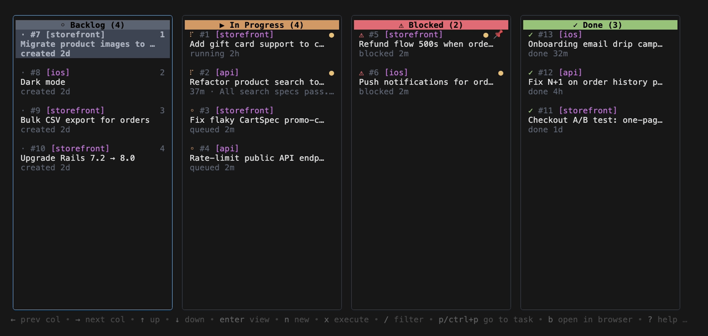

<p></p>

# TaskYou

**Kanban for code agents.**

Calm, cool, a little crazy. An agent for every task. A worktree for every agent.

A Kanban board where the cards do the work. Pick an agent, give it a task, and `ty` starts it in its own git worktree. Stack up a few. Open any card to see what's happening.

Works with Claude Code, Codex, and more. Terminal first, with a CLI, desktop app, and browser UI too.

[Website](https://taskyou.dev) · [First task](docs/getting-started.md) · [Workflow recipes](docs/workflows.md) · [Reference](docs/reference.md)

## Get started

On **macOS or Linux**, with **Git**, **tmux**, and at least one installed, authenticated coding agent:

```sh
curl -fsSL https://taskyou.dev/install.sh | bash
```

Then open TaskYou from the root of an existing Git repository:

```sh
ty
```

Accept the detected project, press **n** to add a small task, choose your agent, and save. Select the card and press **x** to queue it; **Enter** opens its live output. When it needs input, answer in the task's agent pane. Review the resulting changes before merging.

Start with a concrete request: **“Add a troubleshooting section to README.md using the project's actual setup commands. Change documentation only.”**

Want a practice repo? [Try the storefront example](examples/storefront). It includes a concrete task and a local setup script.

Need tmux, a desktop download, or help with setup? Follow the [first-task guide](docs/getting-started.md).



[Watch the tour](https://taskyou.dev/#demo).

## What it does

- **Run tasks in parallel.** Git projects can give each task its own worktree, keeping changes separate while agents work.
- **See what needs you.** Open live output, answer a blocked agent, or retry a task with feedback.
- **Choose the agent per task.** Claude Code, Codex, Gemini, Grok, Cursor, Pi, OpenCode, and OpenClaw are supported. Use your existing agent setup; capabilities vary by executor.
- **Repeat a useful process.** YAML workflows connect planning, implementation, and review. Add a `verify:` command to require passing checks before a step advances.
- **Drive the same queue from anywhere you work.** A terminal UI, scriptable CLI, desktop app, and browser interface share one Go core and SQLite database.

Background work runs on the machine hosting TaskYou. Keep that machine awake, or use a server for long jobs.

## Workflows

Write the steps once. Let the agents handle the handoffs. These recipes cover three common jobs:

| Recipe | Process | Expected output |
|---|---|---|
| [Fix a bug](docs/workflows.md#fix-a-bug) | Reproduce → fix → review | A focused PR with regression-test evidence |
| [Build a feature](docs/workflows.md#build-a-feature) | Plan → implement → parallel code and test reviews → finish | A PR with both reviews addressed |
| [Refactor with checks](docs/workflows.md#refactor-with-checks) | Baseline → refactor → review | A PR documenting preserved behavior and checks |

These workflows commit and push branches, then open a PR for human review. They default to Claude; edit the YAML to choose another executor. [Install and run a recipe](docs/workflows.md).

## CLI

After registering your project, you can create and inspect work without opening the board:

```sh
ty create "Document the setup commands" --project myapp --executor codex
ty list --project myapp
ty show 123  # replace 123 with your task ID
```

Queue it with `ty execute 123`, then open `ty` to watch it. The TUI starts the background daemon automatically. [CLI and daemon reference](docs/reference.md#full-cli-scriptability).

## Choose your interface

| Interface | Start here |
|---|---|
| Terminal | Run `ty` in your project. |
| CLI | Run `ty --help`. Commands also support scripts and agents. |
| Desktop | [Download macOS or Linux bundles](https://github.com/bborn/taskyou/releases/latest). |
| Browser | Run `ty serve` with a build containing the web UI; open `http://localhost:8080`. |

[Desktop installation details](docs/reference.md#the-gui) · [SSH access](docs/reference.md#ssh-access--deployment) · [Agent orchestration](docs/orchestrator.md) · [Plugins](docs/plugins.md)

## Development

Go 1.26 or later is required to build from source. Prebuilt releases do not require Go.

```sh
make build
make test
make lint
```

See [DEVELOPMENT.md](DEVELOPMENT.md) for conventions and [AGENTS.md](AGENTS.md) for the architecture. The core lives in `internal/`; CLI entry points live in `cmd/`; the desktop and browser UI lives in `desktop/`.

TaskYou is [MIT licensed](LICENSE). Your coding agent's own pricing and authentication still apply.
