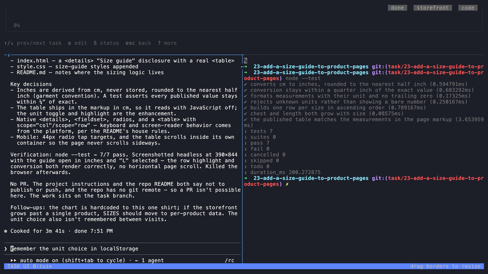

# Your first task

Start with a small documentation change in a repo you already have. You will need at least one Git commit in it.

## Install

TaskYou runs on macOS and Linux. You need Git, tmux, and an installed coding agent that you have already signed in to. Agent usage is billed by your agent provider; TaskYou is free and MIT licensed.

```sh
curl -fsSL https://taskyou.dev/install.sh | bash
```

This installs prebuilt binaries in `~/.local/bin`. You do not need Go. Follow the installer's PATH instructions if your shell cannot find `ty`.

Missing tmux? On macOS, run `brew install tmux`. On Debian or Ubuntu, run `sudo apt-get install tmux`. Use your distribution's package manager elsewhere.

Before continuing, check that `git --version`, `tmux -V`, and your chosen agent's own CLI work in the same terminal. TaskYou supports Claude Code, Codex, Gemini, Grok, Cursor, Pi, OpenCode, and OpenClaw; individual executor features differ.

## Try the practice project

Want to see it work before using your own repo? [Download the storefront](downloads/taskyou-storefront.zip), unzip it, and run `bash start.sh` inside its folder. You also need Node.js 18 or later for this example's tests.

The script prepares a Git repository and opens TaskYou. Accept the project, press **n**, pick your agent, and paste:

> Add a size guide to product pages. Show measurements in cm and inches. Keep it usable on mobile. Add tests for the conversion and run node --test. Do not push or open a PR.

Save and press **x**. Open the card to watch the executor. Run `node --test` in its shell, then open the worktree's `index.html` to try the result. This is the starting project used in the tour; the size guide is yours to build. Nothing runs until you queue it.

## Open your project

In your terminal, change into the root of the repository you want to work on, then run:

```sh
ty
```

TaskYou offers to register the detected project. Accept it and check that the path is correct and worktree isolation is enabled. Project instructions may be imported from files such as `AGENTS.md` or `CLAUDE.md`; inspect them in Settings if needed.

If you see the welcome screen, choose **Set up a project** and select your repository. If the project already exists, TaskYou opens the board. The TUI starts the background daemon for you.

## Give it a small, specific task

Press **n**. Select your project and an agent you already use. Leave the permission mode at its normal setting for your first task.

Try this request:

> Add a troubleshooting section to README.md using the project's actual setup commands. Explain three common setup failures and their fixes. Change documentation only. Do not push or open a pull request; leave the changes for me to review.

Save the task, select its card, and press **x** to queue it. Press **Enter** to open its details and live agent output.

[](media/task-review-tui.png)

The initial request explicitly keeps this first exercise local. Automated workflow recipes have a different handoff: they push branches and open a PR.

## Answer when it needs you

If the task moves to **Blocked**, open it and read the agent's latest output. Answer questions or permission prompts in the agent pane. To change the request or recover a stopped task, use **r** to retry with feedback.

Blocked means the task needs attention; it is not necessarily a failure. **Done** is a task state, not a guarantee that the change is correct.

## Review the result

Read the output and inspect the changed files in the task's worktree. The task details show its working directory. Confirm that the commands match your project and the change stayed within the request. Merge only after your review.

For the next task, choose a small bug with a clear expected result. For multi-step work, try a [workflow recipe](workflows.md).

## Prefer commands?

From the root of your repository, register it once and create a task:

```sh
ty projects create myapp --path "$PWD"
ty create "Document the setup commands" --project myapp --executor codex
ty list --project myapp
```

Use the ID printed by `create` in place of `123` below:

```sh
ty show 123
ty execute 123
ty
```

Choose `--executor claude` or another supported executor if that is what you have installed. If you already registered this repository through the TUI, use its existing project name and skip `projects create`.

`execute` queues the task. Keep the daemon running to process it: opening `ty` starts it automatically, or use `ty daemon` for CLI-only operation.

## If something gets stuck

| What you see | What to do |
|---|---|
| `ty: command not found` | Add `~/.local/bin` to your PATH using the installer's instructions, then open a new terminal. |
| No agent starts | Check `tmux -V`, then launch the selected agent directly and complete its sign-in. |
| The task stays queued | Run `ty daemon status`. Open `ty` to start the daemon, then inspect task output for errors. |
| The agent is waiting | Open the task and answer its question or permission prompt in the agent pane. |
| The worktree cannot build | Configure your project's [worktree init script](reference.md#worktree-setup-script) to install dependencies and set up the environment. |
| Work stops when the computer sleeps | Run TaskYou on a machine that stays awake. See [SSH access](reference.md#ssh-access--deployment) for server use. |

## Want the desktop app?

Get the macOS Apple Silicon DMG or Linux AppImage/DEB from the [latest release](https://github.com/bborn/taskyou/releases/latest). The desktop app includes the TaskYou engine; tmux and an authenticated agent are still required. See [desktop installation](reference.md#the-gui) for macOS first-launch details.

For the browser UI, use `ty serve` with a build that includes the web UI, then open `http://localhost:8080`. See the [full reference](reference.md) for configuration and commands.
