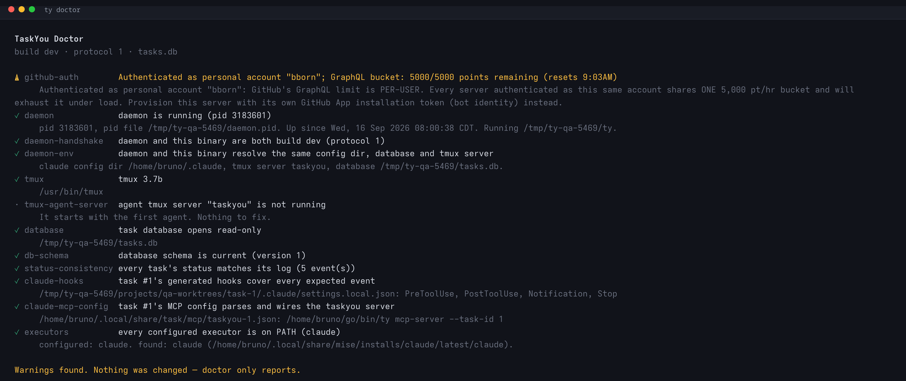
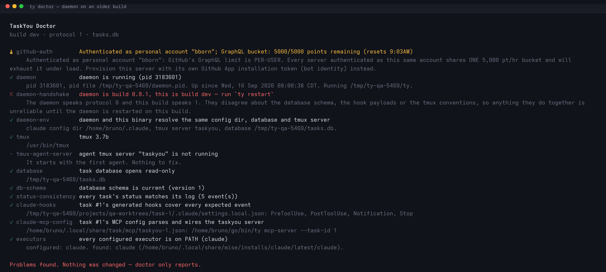
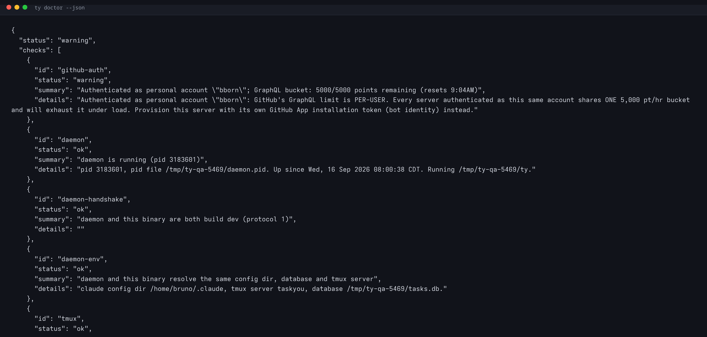

# QA Report — daemon/client build handshake and a read-only `ty doctor`

- **Date:** 2026-09-16 · **Branch:** task/5469-daemonclient-version-handshake-and-a-ful
- **Harness:** `scripts/qa/ty-qa-up.sh` (isolated instance at `/tmp/ty-qa-5469`,
  its own database, tmux server and daemon pid file — the live install was never
  touched). Three tasks seeded; task #1 forced to `processing` with a worktree,
  a generated `.claude/settings.local.json` and a per-task MCP config, so the
  hook and MCP checks had a live task to inspect.
- **Daemon:** a real `ty daemon` from this branch, running against the isolated
  instance for every run below.

## Screenshots

| | |
|---|---|
| `ty doctor` — every check, real machine |  |
| `ty doctor --strict` with the daemon on an older build |  |
| `ty doctor --json` |  |

## What was tested → PASS

| Case | How | Result |
|---|---|---|
| Daemon writes its build record | started `ty daemon`, read `daemon.pid.info` | PASS — version, protocol, pid, started_at, executable, claude config dir, tmux socket, db path |
| Record is removed on stop | `ty daemon stop` | PASS — `daemon.pid.info` gone, `ty doctor` back to `daemon is not running` |
| **Match** | client and daemon on the same build | PASS — `daemon and this binary are both build dev (protocol 1)`, exit 0 |
| **Build-only mismatch** | rebuilt with `-X main.version=0.9.9`, ran `ty list` against the running dev daemon | PASS — stderr `⚠ daemon is build dev, this is build 0.9.9 — run 'ty restart' when convenient`; `daemon-handshake` = warning; exit 0 |
| **Protocol mismatch** | record rewritten to protocol 0 / build 0.9.1 | PASS — stderr `✗ daemon is build 0.9.1, this is build dev — run 'ty restart'`; `daemon-handshake` = error; `ty doctor` exit 1 (doctor-mismatch.png) |
| **Environment divergence** | client run with `TASKYOU_TMUX_SOCKET=somewhere-else` | PASS — `daemon-env` warning naming **both** values: `tmux server: daemon taskyou, this process somewhere-else` |
| **No record** (older daemon / placed host) | pid file present, no `.info` | PASS — `daemon` ok, `daemon-handshake` and `daemon-env` info, never an error, nothing blocked |
| Stale record | record's pid ≠ live daemon's | PASS — ignored; no phantom mismatch |
| `--strict` | warnings present, no errors | PASS — exit 1 under `--strict`, exit 0 without |
| `--json` shape | `ty doctor --json \| jq` | PASS — `{status, checks:[{id,status,summary,details}]}`, 12 checks, `details` present even when empty (doctor-json.png) |
| Doctor is read-only | ran against a database with the schema stamp deleted | PASS — reported `info: database records no schema version`, did **not** stamp it; ran against a missing database, did **not** create one; never started a daemon or a tmux server |
| Live task hooks / MCP | task #1 with generated settings | PASS — `task #1's generated hooks cover every expected event`; dropping one event flips the check to error naming it |

## Notes

- The screenshots were rendered from the real ANSI bytes of each run (captured
  through a pty) and screenshotted with headless chromium, because VHS — the
  harness's normal renderer — produces no frames on this machine. The capture
  path in `scripts/qa/ty-qa-shoot.sh` gained `TY_QA_SHOT_CMD` in this branch, so
  a CLI report can be shot the same way a TUI screen is once VHS works.
- `github-auth` shows a warning here because this machine's `gh` is a personal
  account. That is the original doctor check, unchanged, and is correct.
