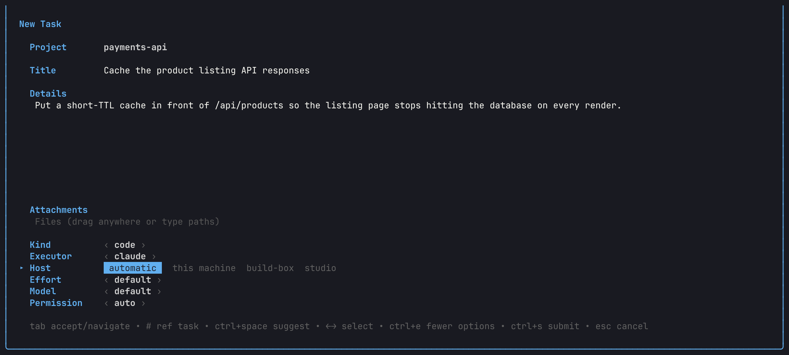
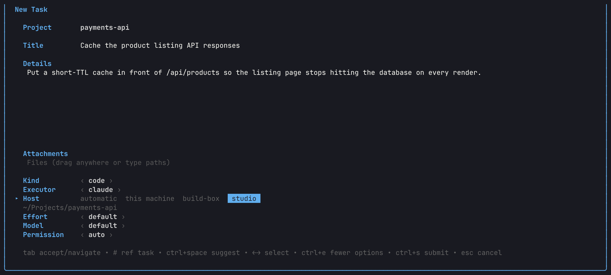
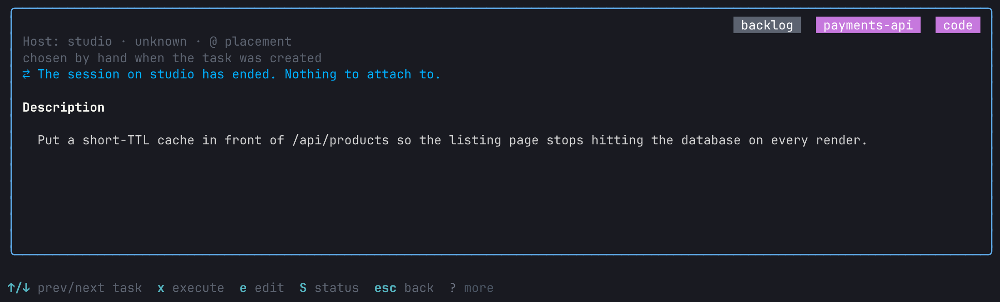
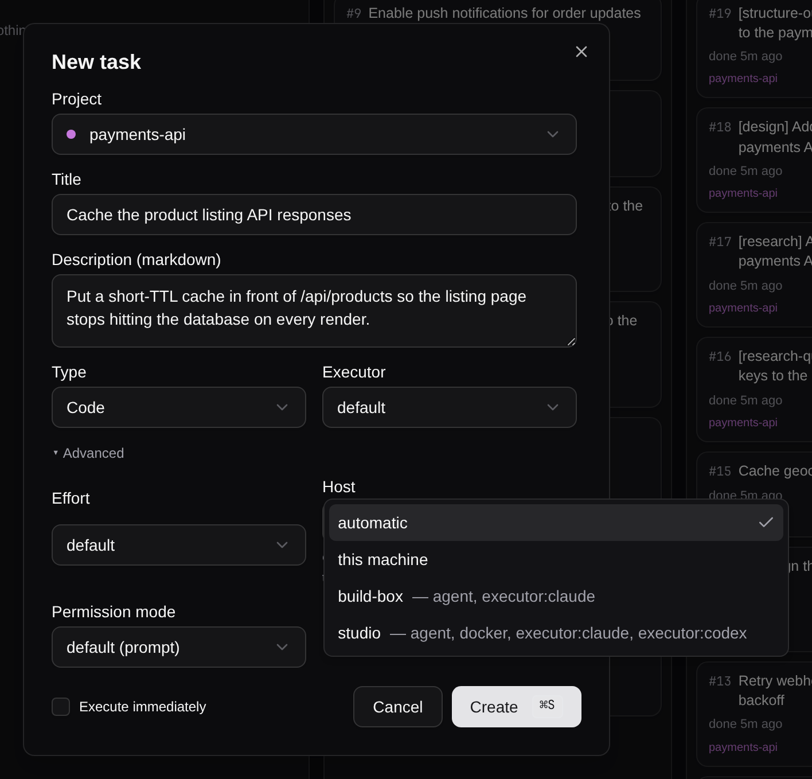
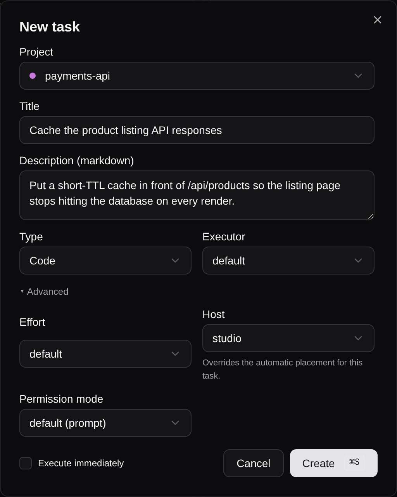
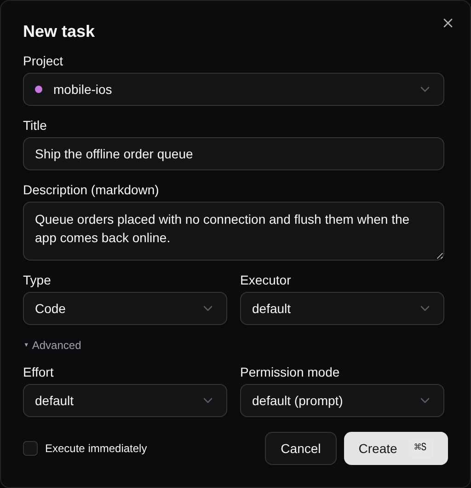

# QA Report — choosing a host when creating a task

- **Date:** 2026-09-15 · **Branch:** task/5432-add-manual-placement-selection-for-confi
- **Harness:** `scripts/qa` (isolated instance at `/tmp/ty-qa`, seeded with `ty-qa-seed.sh`)
- **Fleet:** `ty-on` installed as a plugin into the isolated instance, reading a
  throwaway inventory with two hosts — `studio` (ssh `studio`, claude + codex)
  and `build-box` (ssh `build-box.internal`, claude only) — both with checkouts
  of `payments-api` and `storefront`, neither serving `mobile-ios`. Nothing was
  contacted over SSH: every assertion below is about what ty offers and records.

## What was tested → PASS

| Surface | Evidence | Result |
|---|---|---|
| TUI new-task form shows a **Host** field once a plugin offers machines; defaults to `automatic` | placement-choice-tui-hosts.png | PASS — `automatic · this machine · build-box · studio` |
| TUI: choosing a host shows that project's checkout on it | placement-choice-tui-chosen.png | PASS — `studio` selected, `~/Projects/payments-api` beneath |
| TUI: the choice reaches the task | placement-choice-tui-detail.png, `ty place 23` | PASS — `Host: studio`, reason `chosen by hand when the task was created` |
| GUI: **Host** select under Advanced lists the same machines with their capabilities | placement-choice-gui-hosts.png | PASS |
| GUI: choosing one and creating posts it | placement-choice-gui-chosen.png | PASS — `POST /api/tasks {"placement":"studio","placement_workdir":"~/Projects/payments-api"}` → 201 |
| GUI: a project no host serves gets **no Host field at all** | placement-choice-gui-none.png | PASS — `GET /api/placement/hosts?project=mobile-ios` → `{"hosts":[]}`, 0 Host fields rendered |
| CLI: `ty create --host` records the same decision, by ssh destination or by inventory name | CLI runs below | PASS |
| CLI: `--host` completion lists `local` + the offered machines | `ty __complete create --project demo --host ''` | PASS |
| Automatic (the default) records nothing, leaving the resolver to answer at spawn | `ty place` on a task created without `--host` | PASS — "nothing has been decided yet" |
| A host nothing can name a directory for is refused, and the task survives | `ty create --host nowhere` | PASS — task created, placement not written, exit 1 with the reason |

### CLI transcript (isolated DB, same inventory)

```console
$ ty create "Run on mona" -p demo --host mona.example
Created task #1: Run on mona
$ ty place 1
Task #1: Run on mona
  Runs:   mona.example
  Dir:    ~/Projects/demo
  Reason: chosen by hand when the task was created

$ ty create "Automatic placement" -p demo
Created task #2: Automatic placement
$ ty place 2
Task #2: Automatic placement
  Runs:   here, but nothing has been decided yet
  Note:   the placement resolver will be asked on its next run

$ ty create "Bogus host" -p demo --host nowhere
Created task #4, but its host could not be set: say which directory on nowhere the task should use

$ ty create "Named by inventory label" -p demo --host mona   # label, not ssh destination
$ ty place 5
  Runs:   mona.example          # recorded as the destination the label stands for
  Dir:    ~/Projects/demo
```

## Screenshots

### TUI — the Host field, and a machine chosen





### TUI — the choice on the created task



### GUI — the same choice under Advanced





### GUI — a project no host serves



## Found and fixed during QA

### QA-001 · MEDIUM (product, layout) — long host labels stretched the GUI Host select past the dialog
The first GUI shot showed the trigger rendering `studio — agent, docker,
executor:claude, executor:codex`, which widened the Advanced grid's right column
until the select and its helper text were clipped by the dialog edge (the label
was cut mid-word at `executor:c`). Fixed in `desktop/src/components/TaskForm.tsx`:
the trigger now renders the machine's **name** only (`hostLabel`), the capability
list stays in the open list as muted secondary text, and the column is
`min-w-0` so no option can stretch it. Re-shot after the fix — the screenshots
above are the fixed build.

## Notes / not fixed

- **Harness gap (test infra):** `ty-qa-tui.sh` and `ty-qa-shoot.sh` forward only
  `WORKTREE_DB_PATH` / `WORKTREE_SESSION_ID` (plus the routines vars) into the
  TUI's environment, so a placement plugin (`TY_PLUGINS_DIR`, `ON_HOSTS`) cannot
  be reached by a harness-launched TUI. This session drove tmux directly with
  those vars instead. `ty-qa-shoot.sh` already has the right shape for it
  (`TY_QA_SHOT_ENV`); `ty-qa-tui.sh` wants the same knob. Left alone here to keep
  this PR to the feature.
- **VHS:** `ty-qa-shoot.sh` could not run on this machine — vhs reports success
  and writes no GIF, so no frame can be extracted. The TUI shots above were taken
  from `tmux capture-pane -e` (real TUI, real size) rendered to PNG through a
  terminal font. Same pixels, different path; worth a look before the next
  screenshot session that needs `ty-qa-shoot.sh`.
- Neither host exists, so nothing was launched over SSH. That is by design for
  this feature — choosing a host at creation deliberately does not probe it, and
  an unreachable host fails visibly at spawn, exactly as a resolver's answer does.

## Health

Functional 100 · Visual 100 (after QA-001) · UX 100 · Test-infra 70 (harness env
forwarding, vhs).
