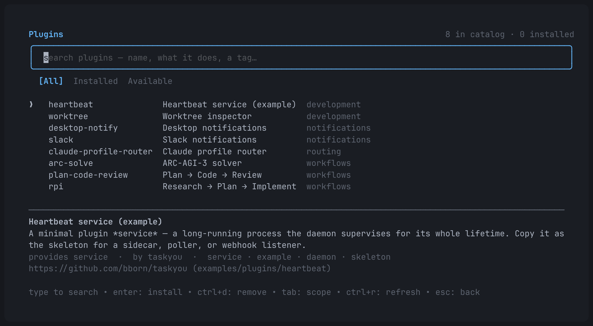
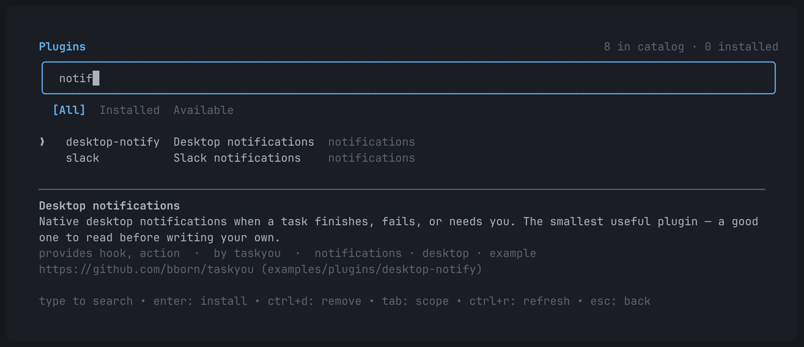
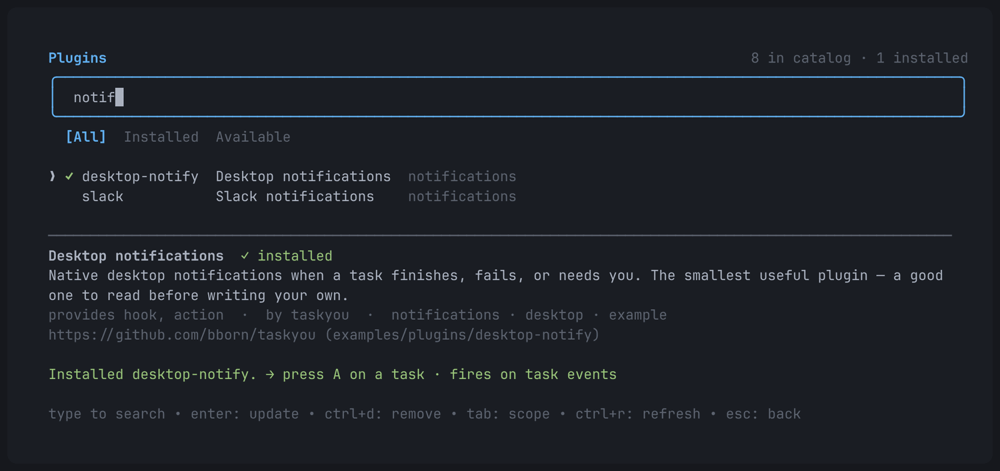
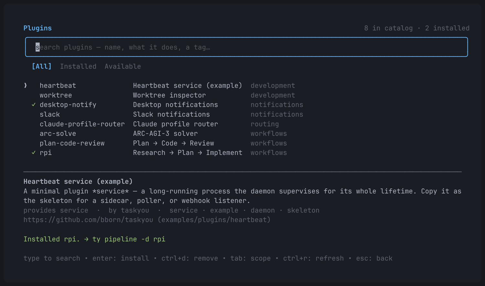
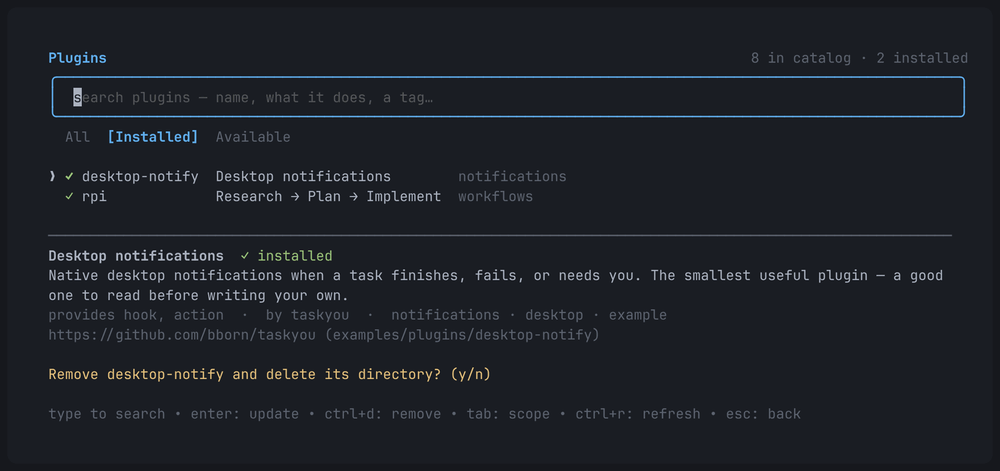
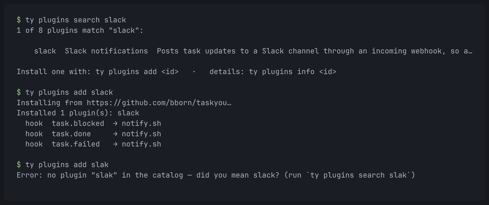
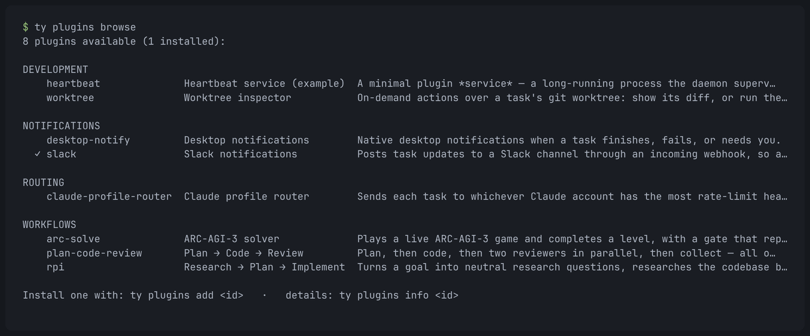
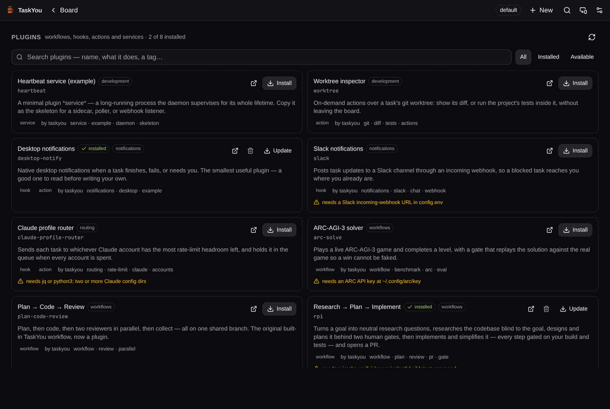
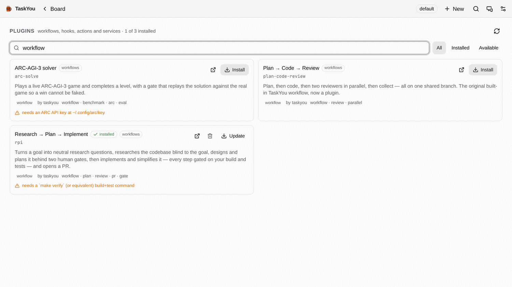
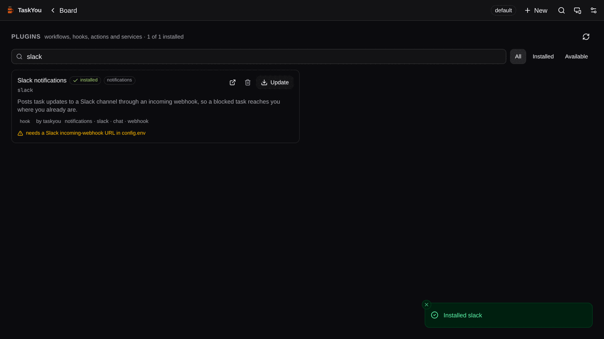

# QA Report — plugin discovery, search and installation

- **Date:** 2026-09-16 · **Branch:** `task/5461-improve-plugin-discovery-and-installatio`
- **Harness:** `scripts/qa` (isolated instance at `/tmp/ty-qa-plugins`, seeded with
  `ty-qa-seed.sh`, daemon frozen). Plugins dir isolated with
  `TY_PLUGINS_DIR=/tmp/ty-qa-plugins/plugins`; nothing touched
  `~/.config/task/plugins`.
- **Catalog:** `TY_PLUGIN_REGISTRY=""` throughout, i.e. **only the snapshot compiled
  into the binary** — proving discovery works with no network and no configuration.
  Installs themselves did hit the network (real `git clone` of
  `github.com/bborn/taskyou` and `github.com/taskyou/plugins`).
- **GUI:** real `ty serve` (built with `-tags ui`) on `:8899`, driven headlessly.

## What was tested → PASS

| Surface | Check | Evidence | Result |
|---|---|---|---|
| TUI | `m` opens a searchable catalog; 8 entries, 0 installed, no network | plugins-tui-browse.png, `.view == "plugin_browser"` | PASS |
| TUI | typing filters live; a term matching a *tag* and a *description* finds both plugins | plugins-tui-search.png (`notif` → desktop-notify, slack) | PASS |
| TUI | `enter` installs: spinner → ✓ → the row flips to installed, and the status line names **what you can now run** | plugins-tui-installed.png (`Installed desktop-notify. → press A on a task · fires on task events`) | PASS |
| TUI | installing a workflow plugin names its command | plugins-tui-after-install.png (`Installed rpi. → ty pipeline -d rpi`) | PASS |
| TUI | the installed workflow is immediately resolvable | `ty pipeline --list` → `rpi (custom)` with all 8 steps | PASS |
| TUI | `tab` cycles All / Installed / Available | plugins-tui-remove.png (`[Installed]`, 2 rows) | PASS |
| TUI | `ctrl+d` asks before deleting a directory; anything but `y` cancels | plugins-tui-remove.png | PASS |
| TUI | `esc` clears a typed query first and only then leaves the view | `plugin_browser` → `dashboard` on the second `esc` | PASS |
| CLI | `ty plugins search` ranks by handle/name over description | plugins-cli-search-install.png | PASS |
| CLI | `ty plugins add <id>` installs **one** plugin out of a collection repo | plugins-cli-search-install.png; `plugins/slack/` only | PASS |
| CLI | a typo is answered with the nearest catalog entry, not just a failure | `add slak` → *did you mean slack?* | PASS |
| CLI | `ty plugins browse` groups by category with globally aligned columns | plugins-cli-browse.png | PASS |
| CLI | `ty plugins update` handles both shapes (checkout pull, subdir re-copy) | transcript below | PASS |
| CLI | removing one plugin from a collection leaves its siblings | transcript below | PASS |
| GUI | Plugins view lists the catalog with install state, provides, tags and prerequisites | plugins-gui-browse.png | PASS |
| GUI | search filters over the same API/ranking as the TUI | plugins-gui-search.png (`workflow` → 3) | PASS |
| GUI | Install actually installs, toasts, and flips the card to Update/Remove | plugins-gui-installed.png; `plugins/slack` on disk | PASS |
| Parity | `Plugins` covered in `desktop/capabilities.json` with its four routes | `go test ./internal/parity/` | PASS |
| Types | `tsc --noEmit` on `desktop/` | clean | PASS |

## CLI transcript (isolated plugins dir, bundled catalog only)

```console
$ ty plugins search notify
1 of 8 plugins match "notify":

    desktop-notify  Desktop notifications  Native desktop notifications when a task finishes, fails, or needs you.

Install one with: ty plugins add <id>   ·   details: ty plugins info <id>

$ ty plugins add desktop-notify
Installing from https://github.com/bborn/taskyou…
Installed 1 plugin(s): desktop-notify
  hook    task.blocked              → notify.sh
  hook    task.done                 → notify.sh
  hook    task.failed               → notify.sh
  action  Send a test notification  ty plugins run desktop-notify test
                                            # 2.7s, and only that one subdirectory

$ ty plugins info desktop-notify
...
Installed at /tmp/ty-qa-plugins/plugins/desktop-notify
  from       https://github.com/bborn/taskyou (examples/plugins/desktop-notify) · 2026-09-16T12:36:24Z

$ ty plugins add taskyou/plugins                       # owner/repo shorthand, whole collection
Installed 4 plugin(s): arc-solve, claude-profile-router, plan-code-review, rpi

$ ty plugins update                                     # both install shapes at once
  plugins updated (arc-solve, claude-profile-router, plan-code-review, rpi)   # git pull
  desktop-notify updated (desktop-notify)                                     # re-copied from its subdir

$ ty plugins remove rpi
Removed plugin "rpi" (/tmp/ty-qa-plugins/plugins/plugins/rpi).
Note: it was part of a shared git checkout; its sibling plugins remain, and re-adding that source may restore it.

$ ty plugins add slak
Error: no plugin "slak" in the catalog — did you mean slack? (run `ty plugins search slak`)
```

## Screenshots

### TUI — `m` opens the catalog



### TUI — search



### TUI — installed, with what it made runnable





### TUI — Installed scope and the remove confirmation



### CLI — search, install by name, and a typo



### CLI — browse



### GUI — the Plugins view







## Notes and limitations

- The remote catalog (`https://taskyou.dev/registry.json`) is served from
  `docs/registry.json`, which only exists once this branch merges and Pages
  redeploys. Until then every install resolves against the bundled snapshot —
  which is exactly the degraded path this QA ran under, and it is not degraded in
  any user-visible way beyond the "catalog served from the copy shipped with ty"
  note the browser shows.
- Remote-catalog fetch, cache, TTL, overlay-by-ID and the fallback chain are
  covered by unit tests against an `httptest` server
  (`internal/registry/registry_test.go`) rather than by this manual pass.
- Screenshots were rendered from a real `tmux capture-pane` of the real TUI
  (`tmux new-session -x 140 -y 42`, so the size is not mis-reported) and from
  headless Chromium for the GUI. VHS was not available on this machine.
