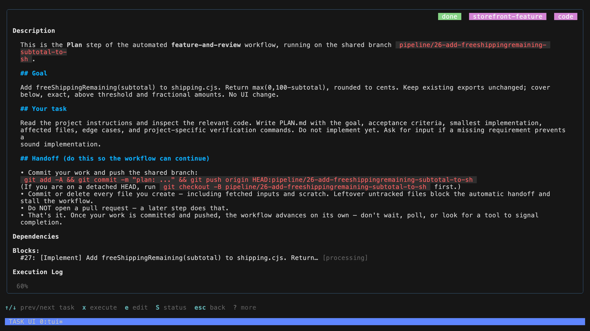

# Workflows

Planning hands off to coding. Coding hands off to review. TaskYou starts each step when its inputs are ready, so you do not have to ferry prompts between agents.

Below are three YAML recipes you can download and edit. Each ends with a pull request.

**Before running:** complete [your first task](getting-started.md), use a project with Git worktrees enabled and a writable `origin` remote, and authenticate `gh` for opening pull requests. These recipes commit and push branches and ask the final agent to open a PR. You review and merge it.

## Install a recipe

Download one of the YAML files below and save it in `~/.config/task/workflows/` with its original filename. Or install all three from your terminal:

```sh
mkdir -p ~/.config/task/workflows
curl -fL https://taskyou.dev/workflows/fix-and-review.yaml -o ~/.config/task/workflows/fix-and-review.yaml
curl -fL https://taskyou.dev/workflows/feature-and-review.yaml -o ~/.config/task/workflows/feature-and-review.yaml
curl -fL https://taskyou.dev/workflows/refactor-and-review.yaml -o ~/.config/task/workflows/refactor-and-review.yaml
ty pipeline --list
```

These download commands replace files with the same names. Keep a copy first if you have customized a recipe. From a source checkout, you can copy the files from `docs/workflows/` instead.

The recipes default to **Claude**, using the agent's default model. Edit `executor:` on individual steps to use another installed agent. Your agent's usual usage costs apply.

Use your registered project name instead of `myapp` in the commands below. Keep the TaskYou daemon running: opening `ty` starts it automatically.

## Fix a bug

**Reproduce → Fix → Review**

Use this when you can describe what happens and what should happen instead. The first step records the cause and a reproduction; the second fixes it and adds regression coverage; the last checks the result and opens a PR.

```sh
ty pipeline "Fix duplicate items when a user submits the form twice. A repeated submission should create only one item." -p myapp -d fix-and-review
```

**Expected output:** a focused PR with reproduction steps, a regression test where practical, and the commands and results used to verify the fix. The recipe asks the agent to stop and report when it cannot reproduce the problem.

[Download fix-and-review.yaml](workflows/fix-and-review.yaml)

## Build a feature

**Plan → Implement → Code review + Test review → Finish**

Use this for a bounded feature with acceptance criteria. Two reviewers run independently after implementation: one examines correctness, the other examines tests and missing scenarios. The final step reads both reports, addresses findings, and opens a PR.

```sh
ty pipeline "Add CSV export to the tasks page. Export the current filter, include title and status, and handle commas and newlines correctly." -p myapp -d feature-and-review
```

**Expected output:** a PR, a short plan, and separate code and test review reports. The final summary names the checks run and any unresolved findings. Running two reviews uses more agent time than a single task.

[Download feature-and-review.yaml](workflows/feature-and-review.yaml)

## Refactor with checks

**Baseline → Refactor → Review**

Use this for internal cleanup with a specific boundary. The first step records current behavior and the checks that protect it. The second changes the implementation. The final step checks for behavior drift and unnecessary scope before opening a PR.

```sh
ty pipeline "Simplify the task filtering code without changing supported filters, ordering, or empty-state behavior." -p myapp -d refactor-and-review
```

**Expected output:** a PR with the baseline, before/after check results, and an explanation of what became simpler. The recipe asks the agent to add characterization coverage where existing tests cannot protect the requested behavior.

[Download refactor-and-review.yaml](workflows/refactor-and-review.yaml)

## Make passing checks a requirement

The recipes ask agents to run tests and report results. For an enforced check, add `verify:` to each implementation or final step using your repository's actual test command. For example, in a Go project:

```yaml
  - name: Fix
    deps: [Reproduce]
    executor: claude
    verify: go test ./...
    prompt: Read BUG.md, implement the fix, and run the regression test.
```

A nonzero exit rejects completion and sends the output back to the agent. Without `verify:`, test execution is an agent instruction rather than an enforced gate. We leave it unset in the downloadable recipes because test commands differ by project. Use your project's remote test runner here if it requires one.

## Inspect before starting

Add `--no-execute` to stage a workflow without queueing its first step:

```sh
ty pipeline "Fix duplicate submissions" -p myapp -d fix-and-review --no-execute
```

Inspect the tasks on the board, then execute the root step when ready. Staging can prepare worktrees and push the shared branch to `origin`. `--no-execute` prevents agent execution; it is not a read-only preview. Use a disposable repository with a local bare remote if you want to inspect a recipe without touching a hosted repository. To make one step wait for your review before continuing, add `gate: true` to that step. See the [workflow reference](reference.md#workflows) for composition, per-project overrides, and configuration.

## Tested in the QA harness

We ran all three recipes against isolated storefront projects with real coding agents. All 11 steps completed, including the automatic handoffs and the feature recipe's two parallel reviews.

The feature reviews found gaps in test coverage and inaccurate rounding documentation. The final step addressed the findings and expanded the suite from 10 to 14 passing tests. The bug-fix recipe passed 5 tests; its regression test also failed against the original implementation. The refactor passed 13 tests and an independent comparison across 11,001 subtotals.

[](media/workflow-handoff.png)

The runs used local bare Git remotes. Hosted pull request creation and merging were not exercised. These recipes did not have `verify:` configured; the test results were checked independently after execution.
